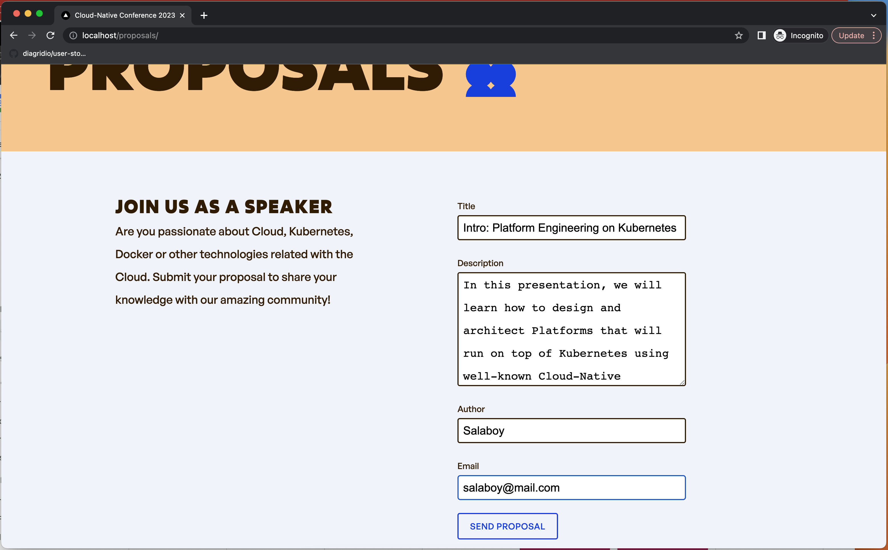

# Capitulo 1 :: (El surgimiento de) Plataformas basadas en Kubernetes

—
_🌍 Disponible en_: [English](README.md) | [中文 (Chinese)](README-zh.md) | [Português (Portuguese)](README-pt.md) | [Español](README-es.md) | [日本語 (Japanese)](README-ja.md) | [French](README-fr.md)
> **Nota:** Presentado por la fantástica comunidad de [ 🌟 contribuidores](https://github.com/salaboy/platforms-on-k8s/graphs/contributors) cloud-native!

—

## Prerrequisitos para los tutoriales

Necesitarás las siguientes herramientas para seguir los tutoriales paso a paso vinculados en el libro:
- [Docker](https://docs.docker.com/engine/install/), v24.0.2
- [kubectl](https://kubernetes.io/docs/tasks/tools/), Cliente v1.27.3
- [KinD](https://kind.sigs.k8s.io/docs/user/quick-start/), v0.20.0
- [Helm](https://helm.sh/docs/intro/install/), v3.12.3

Estas son las tecnologías y versiones utilizadas cuando se desarrollaron los tutoriales.

> [!Advertencia]
> Si deseas utilizar otras tecnologías, como [Podman](https://podman.io/) en lugar de Docker, debería ser posible, ya que no hay nada específico para Docker.

## Escenario de Aplicación para Conferencia

La aplicación que modificaremos y utilizaremos a lo largo de los capítulos del libro representa un “esqueleto caminante” simple, lo que significa que es lo suficientemente compleja como para permitirnos probar suposiciones, herramientas y marcos. Sin embargo, no es el producto final que utilizarán nuestros clientes.

El esqueleto caminante de la “Aplicación para Conferencia” implementa un caso de uso sencillo, que permite a posibles _oradores_ enviar propuestas que los _organizadores_ de la conferencia evaluarán. A continuación, puedes ver la página de inicio de la aplicación:

Observa cómo se utiliza comúnmente la aplicación:
1. **C4P:** Los posibles _oradores_ pueden enviar una nueva propuesta yendo a la sección **Call for Proposals** (C4P) de la aplicación.
   
2. **Revisión y Aprobación:** Una vez que se envía una propuesta, los _organizadores_ de la conferencia pueden revisarlas (aprobar o rechazar) utilizando la sección **Backoffice** de la aplicación.
   
3. **Anuncio:** Si es aceptada por los _organizadores_, la propuesta se publica automáticamente en la página de **Agenda** de la conferencia.
   
4. **Notificación del Orador:** En el **Backoffice**, un _orador_ puede consultar la pestaña de **Notificaciones**. Allí, los posibles _oradores_ pueden encontrar todas las notificaciones (correos electrónicos) enviados a ellos. Un orador verá tanto los correos de aprobación como los de rechazo en esta pestaña.
   

### Una aplicación orientada a eventos

**Cada acción en la aplicación genera nuevos eventos.** Por ejemplo, se emiten eventos cuando se envía una nueva propuesta, cuando se acepta o se rechaza una propuesta, y cuando se envían notificaciones.

Estos eventos son enviados y luego capturados por una aplicación frontend. Afortunadamente, tú, el lector, puedes ver estos detalles en la aplicación accediendo a la pestaña **Eventos** en la sección **Backoffice**.

## Resumen y Contribuciones

¿Deseas mejorar este tutorial? Crea un [issue](https://github.com/salaboy/platforms-on-k8s/issues/new), envíame un mensaje en [Twitter](https://twitter.com/salaboy), o envía una [Pull Request](https://github.com/salaboy/platforms-on-k8s/compare).
