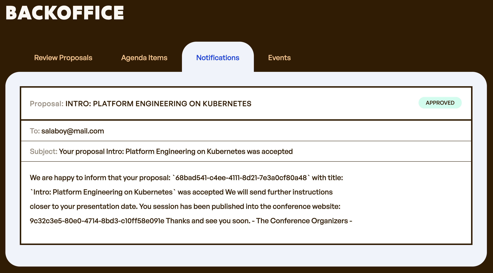

# Chapter 1 :: (The rise of) Platforms on Top of Kubernetes

Thanks to the fantastic cloud-native community, you can read these tutorials in the following languages:

- [Chinese `zh-cn`](README.zh-cn.md) 🇨🇳

## Pre-requisites for the tutorials

You'll need the tools below to follow the step-by-step tutorials linked in the book:
- [Docker](https://docs.docker.com/engine/install/), v24.0.2
- [kubectl](https://kubernetes.io/docs/tasks/tools/), Client v1.27.3
- [KinD](https://kind.sigs.k8s.io/docs/user/quick-start/), v0.20.0
- [Helm](https://helm.sh/docs/intro/install/), v3.12.3

These are technologies and versions used when testing the tutorials.

> [!Warning]
> If you want to use other technologies, like [Podman](https://podman.io/) instead of Docker, it should be possible as there is nothing specific to Docker.

## Conference Application Scenario

The application that we will modify and use throughout the book chapters represents a simple "walking skeleton", meaning that it is complex enough to allow us to test assumptions, tools, and frameworks. Still, it is not the final product that our customers will use. 

The "Conference Application" walking skeleton implements a straightforward use case, allowing potential speakers to submit proposals that the conference organizers will evaluate. 

The flow is simple. Potential speakers can submit a new proposal by going to the application's **Call for Proposals** section.

Once submitted, the conference organizers can review (approve or reject) submitted proposals in the **Backoffice** section of the application.

If accepted, the proposal is automatically published on the conference **Agenda** page.

In the **Backoffice**, you can check the **Notifications** tab that shows all the notifications (emails) sent to the potential speakers. You will see both approval and rejection emails in this tab. 

Every action in the application emits events. Hence, when a new proposal is submitted, when the proposal is accepted or rejected, and when notifications are sent, events are sent and captured by the application frontend. You can check these events in the **Events** tab in the **Backoffice** section.

## Sum up and Contribute

Do you want to improve this tutorial? Create an issue, message me on [Twitter](https://twitter.com/salaboy), or send a Pull Request.

