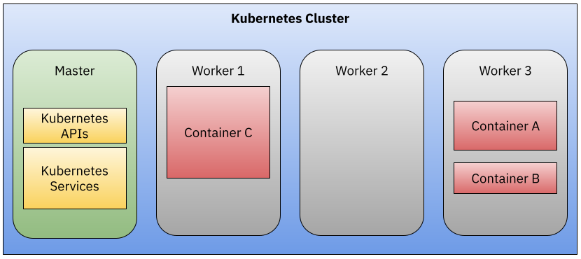
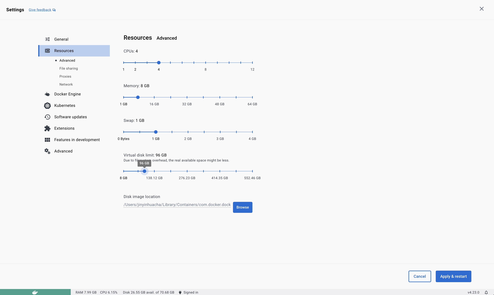

# 第二章 来自云原生应用的挑战

我们将在这个简短的教程里使用 Helm 把会议应用安装到本地的 Kind Kubernetes 集群之中。

可以把 Helm Chart 发布到 Helm Chart 仓库里。另外 Helm 3.7 之后的版本，还可以使用 OCI 格式把 Helm Chart 保存到容器镜像仓库之中。

开始之前，请根据[前一章](../chapter-1/README.zh-cn.md#其它的先决条件)的介绍，检查一下运行后续教程的前置条件

## 用 Kind 创建一个本地 Kubernetes 集群

创建一个 Kind 集群，其中包含三个工作节点和一个控制平面节点。

```
cat <<EOF | kind create cluster --name dev --config=-
kind: Cluster
apiVersion: kind.x-k8s.io/v1alpha4
nodes:
- role: control-plane
  kubeadmConfigPatches:
  - |
    kind: InitConfiguration
    nodeRegistration:
      kubeletExtraArgs:
        node-labels: "ingress-ready=true"
  extraPortMappings:
  - containerPort: 80
    hostPort: 80
    protocol: TCP
  - containerPort: 443
    hostPort: 443
    protocol: TCP
- role: worker
- role: worker
- role: worker
EOF

```



### 在部署应用和其它组件之前，首先载入容器镜像

`kind-load.sh` 脚本会预加载（pull 和 load）容器镜像，我们会使用这些镜像在 Kind 集群中运行后续示例。

预加载的目的是优化启动流程，避免在载入镜像的过程中消耗太多时间。因为所有镜像都被预加载到 Kind 集群，所以应用只需要一分钟就能启动，在这之后，我们还要等 PostgreSQL、Redis 和 Kafka 启动。

进入 `chapter-2` 目录，把下面的命令拷贝到你的终端里：

```
./kind-load.sh
```

脚本运行结束后，所有必要的镜像都会被拉取到本地并被加载到 Kind 集群的所有节点之中。如果你使用的是运供应商的 Kubernetes 集群，因为带宽足够，可能就没有必要使用这个脚本了。

**注意：** 如果你是在 MacOS 系统运行 Docker Desktop，虚拟磁盘设置过小时会遇到下面的报错：

```
$ ./kind-load.sh
...
Command Output: Error response from daemon: write /var/lib/docker/.../layer.tar: no space left on device
```

你可以在 ``Settings -> Resources`` 菜单栏修改 Virtual Disk limit 的值。



### 安装 NGINX Ingress 控制器

我们要用 NGINX Ingress Controller 把笔记本电脑上的流量路由到集群内运行的服务。NGINX Ingress Controller 运行在集群内部，但向外界网络开放提供服务。

```
kubectl apply -f https://raw.githubusercontent.com/kubernetes/ingress-nginx/release-1.8/deploy/static/provider/kind/deploy.yaml
```

检查一下 `ingress-nginx` 命名空间中的 Pod 是否正常启动：

```
> kubectl get pods -n ingress-nginx
NAME                                        READY   STATUS      RESTARTS   AGE
ingress-nginx-admission-create-cflcl        0/1     Completed   0          62s
ingress-nginx-admission-patch-sb64q         0/1     Completed   0          62s
ingress-nginx-controller-5bb6b499dc-7chfm   0/1     Running     0          62s
```

这样，您就可以将来自 `http://localhost` 的流量路由到群集内部的服务。请注意，我们在创建群集时为控制面节点提供了额外的参数和标签：

```
nodes:
- role: control-plane
  kubeadmConfigPatches:
  - |
    kind: InitConfiguration
    nodeRegistration:
      kubeletExtraArgs:
        node-labels: "ingress-ready=true" # 允许在控制面节点上运行 Ingress 控制器
  extraPortMappings:
  - containerPort: 80 # 把本地节点的 80 端口绑定给 Ingress 控制器，以便对集群内的服务进行路由
    hostPort: 80
    protocol: TCP
  - containerPort: 443
    hostPort: 443
    protocol: TCP
```

集群和 Ingress 控制器都安装和配置完成之后，就可以开始安装应用了。

## 安装示例应用

Helm 3.7 及后续版本，可以使用 OCI 镜像的方式发布、下载和部署 Helm Chart。这样就可以用 Docker Hub 充当 Helm Chart 仓库，运行如下命令就能安装我们的示例应用：

```
helm install conference oci://docker.io/salaboy/conference-app --version v1.0.0
```

还可以使用下面的命令查看 Chart 的详细信息：

```
helm show all oci://docker.io/salaboy/conference-app --version v1.0.0
```

确认所有的 Pod 都已经启动并运行。注意如果你的网络连接比较差，应用的启动时间会比较长。这是因为应用依赖了一些基础组件（Redis、Kafka 和 PostgreSQL），这些组件需要启动运行，进入就绪状态以便为客户端提供服务。Kafka 大概有 335 MB、PostgreSQL 大概有 88 MB，Redis 也有大约 35 MB。

几分钟以后，你会看到类似下面的输出内容：

```
kubectl get pods
NAME                                                           READY   STATUS    RESTARTS      AGE
conference-agenda-service-deployment-7cc9f58875-k7s2x          1/1     Running   4 (45s ago)   2m2s
conference-c4p-service-deployment-54f754b67c-br9dg             1/1     Running   4 (65s ago)   2m2s
conference-frontend-deployment-74cf86495-jthgr                 1/1     Running   4 (56s ago)   2m2s
conference-kafka-0                                             1/1     Running   0             2m2s
conference-notifications-service-deployment-7cbcb8677b-rz8bf   1/1     Running   4 (47s ago)   2m2s
conference-postgresql-0                                        1/1     Running   0             2m2s
conference-redis-master-0                                      1/1     Running   0             2m2s
```

`RESTARTS` 列中的内容说明应用容器启动之后因为无法访问 Kafka，被迫重启来等待 Kafka 准备就绪。

现在可以使用浏览器访问 [http://localhost](http://localhost) 来浏览应用的页面了。


## 重要：清理

这个示例应用安装了 PostgreSQL、Redis 和 Kafka，所以如果要重新安装应用，必须删除现有的 PVC。这三个组件会使用 PVC 存储数据。如果忘记删除 PVC，那么新安装的应用就会使用旧的凭据来连接新部署的数据库。

在删除之前先列出 PVC：

```
kubectl get pvc
```

你会看到：

```
NAME                                   STATUS   VOLUME                                     CAPACITY   ACCESS MODES   STORAGECLASS   AGE
data-conference-kafka-0                Bound    pvc-2c3ccdbe-a3a5-4ef1-a69a-2b1022818278   8Gi        RWO            standard       8m13s
data-conference-postgresql-0           Bound    pvc-efd1a785-e363-462d-8447-3e48c768ae33   8Gi        RWO            standard       8m13s
redis-data-conference-redis-master-0   Bound    pvc-5c2a96b1-b545-426d-b800-b8c71d073ca0   8Gi        RWO            standard       8m13s
```

然后开始删除操作：

```
kubectl delete pvc  data-conference-kafka-0 data-conference-postgresql-0 redis-data-conference-redis-master-0
```

因为部署 Helm 时会使用不同的 Release 名字，所以 PVC 名字也会有所不同。

如果要删除整个 Kind 集群，可以运行下面的命令：

```
kind delete clusters dev
```

## 下一步

在此强烈建议你使用云服务商提供的真正的 Kubernetes 集群来进行测试。多数云供应商都会提供免费试用的机会，你可以在免费的集群上运行这些例子。[learnk8s](https://github.com/learnk8s/free-kubernetes) 网站提供了这方面的相关信息。

如果你能够在云供应商的集群上运行应用，就可以在相对真实的环境中体验第二章中提到的所有主题。

## 总结和贡献

在这个简短的教程中，我们已经成功安装了示例应用的主干部分。在接下来的章节中，我们将以该应用为例进行讲解。本章内容涵盖了使用 Kubernetes 集群并与之交互的基础知识，因此请确保前面的步骤都得以正常运行。

要改进这些教程，欢迎在 [Twitter](https://twitter.com/salaboy) 上联系我或者提交 PR。
