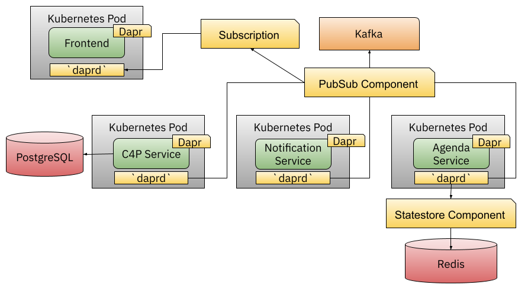
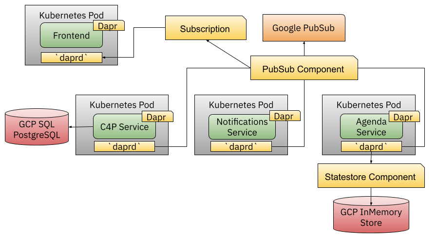
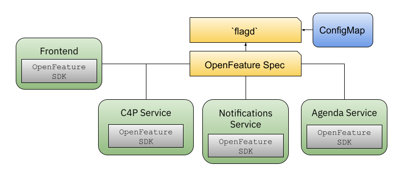

# 第7章 :: アプリケーションの共通課題

---
_🌍 利用可能な言語_: [English](README.md) | [中文 (Chinese)](README-zh.md) | [日本語 (Japanese)](README-ja.md)

> **注意:** これは素晴らしいクラウドネイティブコミュニティの [🌟 コントリビューター](https://github.com/salaboy/platforms-on-k8s/graphs/contributors) によってもたらされました！

---

このステップバイステップのチュートリアルでは、ほとんどの分散アプリケーションが直面する日常的な課題を解決するために、アプリケーションレベルのAPIを提供する[Dapr](https://dapr.io)の使用について見ていきます。

次に、[OpenFeature](https://openfeature.dev)を見ていきます。これは、開発チームが新機能のリリースを継続し、ステークホルダーがこれらの機能を顧客に対していつ有効/無効にするかを決定できるように、フィーチャーフラグを標準することを目的としたプロジェクトです。

両プロジェクトはサービスコード内で使用する新しいAPIとツールを開発者に提供することに焦点を当てているため、アプリケーションの新バージョン（`v2.0.0`）をデプロイします。このリポジトリの`v2.0.0`ブランチに、この新バージョンに必要なすべての変更が含まれています。[ここでブランチ間の違いを比較することもできます](https://github.com/salaboy/platforms-on-k8s/compare/v2.0.0)。

# インストール

[Dapr](https://dapr.io)と[OpenFeature](https://openfeature.dev/)プロバイダーである`flagd`をインストールするには、Kubernetesクラスターが必要です。[第2章](https://github.com/salaboy/platforms-on-k8s/blob/main/chapter-2/README-ja.md#kindでローカルクラスターを作成する)で行ったように、Kubernetes KinDを使用してクラスターを作成できます。

次に、以下のコマンドを実行してクラスターにDaprをインストールできます：
```shell
helm repo add dapr https://dapr.github.io/helm-charts/
helm repo update
helm upgrade --install dapr dapr/dapr \
--version=1.11.0 \
--namespace dapr-system \
--create-namespace \
--wait
```

Daprがインストールされたら、Dapr対応およびフィーチャーフラグ対応のアプリケーションバージョン`v2.0.0`をインストールできます。

# v2.0.0の実行

以下のコマンドを実行して、アプリケーションのv2.0.0をインストールできます：

```shell
helm install conference oci://docker.io/salaboy/conference-app --version v2.0.0
```

このバージョンのHelmチャートは、バージョン`v1.0.0`と同じアプリケーションインフラストラクチャ（PostgreSQL、Redis、Kafka）をインストールします。サービスはRedisとKafkaとの対話にDapr APIを使用するようになりました。このアプリケーシンバージョンでは、`flagd`を使用してOpenFeatureフィーチャーフラグも追加しています。

# DaprによるアプリケーションレベルAPI

バージョン`v2.0.0`では、アプリケーションのポッドをリストすると、各サービス（agenda、c4p、frontend、notifications）にDaprサイドカー（`daprd`）がサービスコンテナと一緒に実行されていることがわかります（READY 2/2）：

```shell
> kubectl get pods
NAME                                                           READY   STATUS    RESTARTS      AGE
conference-agenda-service-deployment-5dd4bf67b-qkctd           2/2     Running   7 (7s ago)    74s
conference-c4p-service-deployment-57b5985757-tdqg4             2/2     Running   6 (19s ago)   74s
conference-frontend-deployment-69d9b479b7-th44h                2/2     Running   2 (68s ago)   74s
conference-kafka-0                                             1/1     Running   0             74s
conference-notifications-service-deployment-7b6cbf965d-2pdkh   2/2     Running   6 (42s ago)   74s
conference-postgresql-0                                        1/1     Running   0             74s
conference-redis-master-0                                      1/1     Running   0             74s
flagd-6bbdc5d999-c42wk                                         1/1     Running   0             74s
```

`flagd`コンテナも実行されていることに注目してください。これについては次のセクションで説明します。

Daprの観点からアプリケーションは次のようになります：



Daprサイドカーは、アプリケーションがStatestore（Redis）とPubSub（Kafka）APIと対話できるようにするDaprコンポーネントAPIを公開します。

以下のコマンドでDaprコンポーネントをリストできます：

```shell
> kubectl get components
NAME                                   AGE
conference-agenda-service-statestore   30m
conference-conference-pubsub           30m
```

各コンポーネントを記述して設定を確認できます：
```shell
> kubectl describe component conference-agenda-service-statestore
Name:         conference-agenda-service-statestore
Namespace:    default
Labels:       app.kubernetes.io/managed-by=Helm
Annotations:  meta.helm.sh/release-name: conference
              meta.helm.sh/release-namespace: default
API Version:  dapr.io/v1alpha1
Auth:
  Secret Store:  kubernetes
Kind:            Component
Metadata:
  Creation Timestamp:  2023-07-28T08:26:55Z
  Generation:          1
  Resource Version:    4076
  UID:                 b4674825-d298-4ee3-8244-a13cdef8d530
Spec:
  Metadata:
    Name:   keyPrefix
    Value:  name
    Name:   redisHost
    Value:  conference-redis-master.default.svc.cluster.local:6379
    Name:   redisPassword
    Secret Key Ref:
      Key:   redis-password
      Name:  conference-redis
  Type:      state.redis
  Version:   v1
Events:      <none>
```

Statestoreコンポーネントが、このサービス名`conference-redis-master.default.svc.cluster.local`で公開されているRedisインスタンスに接続し、`conference-redis`シークレットを使用して接続パスワードを取得していることがわかります。

同様に、Kafkaに接続するPubSub Daprコンポーネントは次のようになります：

```shell
kubectl describe component conference-conference-pubsub 
Name:         conference-conference-pubsub
Namespace:    default
Labels:       app.kubernetes.io/managed-by=Helm
Annotations:  meta.helm.sh/release-name: conference
              meta.helm.sh/release-namespace: default
API Version:  dapr.io/v1alpha1
Kind:         Component
Metadata:
  Creation Timestamp:  2023-07-28T08:26:55Z
  Generation:          1
  Resource Version:    4086
  UID:                 e145bc49-18ff-4390-ad15-dcd9a4275479
Spec:
  Metadata:
    Name:   brokers
    Value:  conference-kafka.default.svc.cluster.local:9092
    Name:   authType
    Value:  none
  Type:     pubsub.kafka
  Version:  v1
Events:     <none>
```

フロントエンドサービスがPubSubコンポーネントに送信されたイベントを受信できるようにする最後のピースは、次のDaprサブスクリプションです：

```shell
> kubectl get subscription
NAME                               AGE
conference-frontend-subscritpion   39m
```

このリソースを記述して設定を確認することもできます：
```shell
> kubectl describe subscription conference-frontend-subscritpion
Name:         conference-frontend-subscritpion
Namespace:    default
Labels:       app.kubernetes.io/managed-by=Helm
Annotations:  meta.helm.sh/release-name: conference
              meta.helm.sh/release-namespace: default
API Version:  dapr.io/v2alpha1
Kind:         Subscription
Metadata:
  Creation Timestamp:  2023-07-28T08:26:55Z
  Generation:          1
  Resource Version:    4102
  UID:                 9f748cb0-125a-4848-bd39-f84e37e41282
Scopes:
  frontend
Spec:
  Bulk Subscribe:
    Enabled:   false
  Pubsubname:  conference-conference-pubsub
  Routes:
    Default:  /api/new-events/
  Topic:      events-topic
Events:       <none>
```

ご覧のように、このサブスクリプションは`Scopes`セクションにリストされているDaprアプリケーション（この場合は`frontend`アプリケーションのみ）の`/api/new-events/`ルートにイベントを転送します。フロントエンドアプリケーションは、イベントを受信するために`/api/new-events/`エンドポイントを公開するだけで済みます。この場合、Daprサイドカー（`daprd`）は`conference-conference-pubsub`と呼ばれるPubSubコンポーネントで受信メッセージを待ち、すべてのメッセージをアプリケーションエンドポイントに転送します。

このバージョンのアプリケーションでは、すべてのサービスからKafkaクライアントと、AgendaサービスからRedisクライアントなどのアプリケション依存関係を削除しています。


依存関係を削除してこれらのコンテナを小さくするだけでなく、Daprコンポーネント APIを消費することで、プラットフォームチームがこれらのコンポーネントの設定方法と、どのインフラストラクチャコンポーネントに対して設定するかを定義できるようになります。同じアプリケーションを[Google PubSub](https://cloud.google.com/pubsub)や[MemoryStoreデータベース](https://cloud.google.com/memorystore)などのGoogle Cloud Platformのマネージドサービスを使用するように設定する場合、アプリケーションコードの変更や新しい依存関係の追加は必要なく、新しいDaprコンポーネント設定だけで済みます。



最後に、これはすべて開発者にアプリケーションレベルのAPI提供することに関するものなので、アプリケーションのサービスの観点からこれがどのように見えるかを見てみましょう。サービスはGoで書かれているため、Dapr Go SDK（これはオプションです）を追加することにしました。

AgendaサービスがDapr Statestoreコンポーネントからデータを保存または読み取りたい場合、Daprクライアントを使用してこれらの操作を実行できます。例えば、[Statestoreから値を読み取るのは次のようになります](https://github.com/salaboy/platforms-on-k8s/blob/v2.0.0/conference-application/agenda-service/agenda-service.go#L136C2-L136C116)：

```golang
agendaItemsStateItem, err := s.APIClient.GetState(ctx, STATESTORE_NAME, fmt.Sprintf("%s-%s", TENANT_ID, KEY), nil)
```

`APIClient`参照は[ここで初期化されたDaprクライアントインスタンスに過ぎません](https://github.com/salaboy/platforms-on-k8s/blob/v2.0.0/conference-application/agenda-service/agenda-service.go#L397)

アプリケーションが知る必要があるのは、Statestore名（`STATESTORE_NAME`）と、取得したいデータを特定するキー（`KEY`）だけです。

アプリケーションが[Statestoreに状態を保存したい場合は次のようになります](https://github.com/salaboy/platforms-on-k8s/blob/v2.0.0/conference-application/agenda-service/agenda-service.go#L197C2-L199C3)：

```golang
if err := s.APIClient.SaveState(ctx, STATESTORE_NAME, fmt.Sprintf("%s-%s", TENANT_ID, KEY), jsonData, nil); err != nil {
		...
}
```  

最後に、アプリケーションコードが[PubSubコンポーネントに新しいイベントを公開したい場合](https://github.com/salaboy/platforms-on-k8s/blob/v2.0.0/conference-application/agenda-service/agenda-service.go#L225)は、次のようになります：

```golang
if err := s.APIClient.PublishEvent(ctx, PUBSUB_NAME, PUBSUB_TOPIC, eventJson); err != nil {
			...
}
```

見てきたように、Daprは使用しているプログラミング言語に関係なく、アプリケーション開発者が使用するためのアプリケーションレベルのAPIを提供します。これらのAPIは、アプリケーションインフラストラクチャコンポーネントのセットアップと管理の複雑さを抽象化し、プラットフォームチームがアプリケーションソースコードの変更を強制することなく、アプリケーションがそれらと対話する方法を微調整することに柔軟性を持たせることができます。

次に、フィーチャーフラグについて話しましょう。このトピックは開発者だけでなく、プロダクトマネージャーやビジネスに近い役割の人々が特定の機能をいつ公開するかを決定できるようにします。

## 誰もがフィーチャーフラグを

[OpenFeature](https://openfeature.dev/)プロジェクトは、異なる言語で書かれたアプリケーションからフィーチャーフラグを消費する方法を標準化することを目的としています。

この短いチュートリアルでは、Conference Application `v2.0.0`がOpenFeatureを使用し、特に`flagd`プロバイダーを使用して、すべてのアプリケーションサービスでフィーチャーフラグを有効にする方法を見ていきます。この例では、シンプルに保つために、Kubernetes `ConfigMap`内でフィーチャーフラグの設定を定義できる`flagd`プロバイダーを使用しました。



Dapr APIと同様に、ここでのアイデアは、選択したプロバイダーに関係なく一貫した体験を得ることです。プラットフォームチームがプロバイダーを切り替えたい場合、例えLaunchDarklyやSplitに切り替えたい場合でも、フィーチャーの取得や評価の方法を変更する必要はありません。プラットフォームチームは、最適だと考えるプロバイダーに自由に切り替えることができます。

`v2.0.0`では、アプリケーションのサービスが使用するフィーチャーフラグを含む`flag-configuration`というConfigMapを作成しました。

以下のコマンドを実行して、ConfigMapに含まれるフラグ設定のJSONファイルを取得できます：

```shell
kubectl get cm flag-configuration -o go-template='{{index .data "flag-config.json"}}'
```

以下のような出力が表示されるはずです：

```json
{
  "flags": {
    "debugEnabled": {
      "state": "ENABLED",
      "variants": {
        "on": true,
        "off": false
      },
      "defaultVariant": "off"
    },
    "callForProposalsEnabled": {
      "state": "ENABLED",
      "variants": {
        "on": true,
        "off": false
      },
      "defaultVariant": "on"  
    },
    "eventsEnabled": {
      "state": "ENABLED",
      "variants": {
        "all": {
          "agenda-service": true,
          "notifications-service": true,
          "c4p-service": true
        },
        "decisions-only": {
          "agenda-service": false,
          "notifications-service": false,
          "c4p-service": true
        },
        "none": {
          "agenda-service": false,
          "notifications-service": false,
          "c4p-service": false
        }
      },
      "defaultVariant": "all"
    }
  }
}
```

この例では3つのフィーチャーフラグが定義されています：
- `debugEnabled`は、アプリケーションのバックオフィスでデバッグタブをオン/オフにできるブールフラグです。これは`v1.0.0`で使用していた環境変数の必要性を置き換えます。アプリケーションのフロントエンドコンテナを再起動せずに、デバッグセクションをオ/オフにできます。
- `callForProposalsEnabled`このブールフラグは、アプリケーションの**Call for Proposals**セクションを無効にすることができます。カンファレンスには潜在的な講演者が提案を提出できる期間があり、その期間が終了したらこのセクションを非表示にできます。このセクションをオフにするだけの特定のバージョンをリリースするのは管理が複雑すぎるため、このためのフィーチャーフラグを持つことは非常に理にかなっています。アプリケーションのフロントエンドコンテナを再起動する必要なく、この変更を行うことができます。
- `eventsEnabled`はオブジェクトフィーチャーフラグです。これは構造を含み、チームが複雑な設定を定義できることを意味します。この場合、どのサービスがイベントを発行できるか（アプリケーションのバックオフィスの「Events」タブ）を設定するための異なるフラグプロファイルを定義しました。デフォルトではすべてのサービスがイベントを発行しますが、`defaultVariant`の値を`none`に変更することで、コンテナを再起動することなく、すべてのサービスのイベントを無効にできます。

以下の手順に従って、デバッグ機能をオンにするためにConfigMapにパッチを当てることができます。まず、ConfigMap内にある`flag-config.json`ファイルの内容をフェッチしてローカルに保存します。

```shell
kubectl get cm flag-configuration -o go-template='{{index .data "flag-config.json"}}' > flag-config.json
```

このファイルの内容を変更します。例えば、デバッグフラグをオンにします：

```json
{
  "flags": {
    "debugEnabled": {
      "state": "ENABLED",
      "variants": {
        "on": true,
        "off": false
      },
    **"defaultVariant": "on"**
    },
    ...
```

次に、既存の`ConfigMap`にパッチを当てます：

```shell
kubectl create cm flag-configuration --from-file=flag-config.json=flag-config.json --dry-run=client -o yaml | kubectl patch cm flag-configuration --type merge --patch-file /dev/stdin
```

約20秒後、アプリケーションのバックオフィスセクションにデバッグタブが表示されるはずです。


このタブにフィーチャーフラグも表示されていることがわかります。

次に、新しい提案を提出して承認してください。「Events」タブにイベントが表示されるのがわかります。


前のプロセスを繰り返し、`eventsEnabled`フィーチャーフラグを`"defaultVariant": "none"`に変更すると、すべてのサービスがイベントの発行を停止します。アプリケーションのユーザーインターフェースから新しい提案を提出して承認し、「Events」タブをチェックして、イベントが発行されていないことを確認してください。`flag-configuration` ConfigMapを変更する際、`flagd`はConfigMapの内容を更新するのに約10秒かかることに注意してください。デバッグタブが有効になっている場合、値が変更されたことが確認できるまでそのスクリーンを更新できます。

**このフィーチャーフラグは、イベントを送信する前にフラグを評価するすべてのサービスによって消費されていることに注意してください。**

最後に、`callForProposalsEnabled`フィーチャーフラグを`"defaultVariant": "off"`に変更すると、アプリケーションのフロントエンドからCall for Proposalメニューオプションが消えます。


フィーチャーフラグの設定を保存するために`ConfigMap`を使用していますが、チームがより速く進むことを可能にする重要な改善を達成しました。開発者は、プロダクトマネージャー（またはステークホルダー）が有効/無効にするタイミングを決定できる新機能をアプリケーションサービスにリリースし続けることができます。プラットフォームチームは、フィーチャーフラグがどこに保存されるか（マネージドサービスまたはローカルストレージ）を定義できます。フィーチャーフラグベンダーで構成されるコミュニティによって推進される標準仕様を使用することで、アプリケーション開発チームは、これらのメカニズムを社内で実装するために必要なすべての技術的側面を定義することなく、フィーチャーフラグを利用できるようになります。

この例では、[コンテキストベース評価](https://openfeature.dev/docs/reference/concepts/evaluation-context#providing-evaluation-context)のような、フィーチャーフラグを評価するためのより高度な機能は使用していません。これは例えば、同じフィーチャーフラグに対して異なる値を提供するためにユーザーの地理的位置を使用したり、[ターゲットキー](https://openfeature.dev/docs/reference/concepts/evaluation-context#targeting-key)を使用したりできます。OpenFeatureの機能や、他にどのような[OpenFeatureフラグプロバイダー](https://openfeature.dev/docs/reference/concepts/provider)が利用可能かについてより深く掘り下げるかどうかは読者次第です。

## クリーンアップ

このチュートリアル用に作成したKinDクラスターを削除したい場合は、次のコマンドを実行できます：

```shell
kind delete clusters dev
```

## 次のステップ

自然な次のステップは、第5章で行ったように、Crossplaneによってプロビジョニングされたインフラストラクチャに対して`v2.0.0`を実行することです。これは、プロビジョニングされたインフラストラクチャに接続するようにConference ApplicationのHelmチャートを設定する責任を持つ、プラットフォームウォーキングスケルトンによって管理できます。このトピックに興味がある場合、CrossplaneとDaprがなぜ一緒に機能するように設計されているかについてのブログ記事を書きました：[https://blog.crossplane.io/crossplane-and-dapr/](https://blog.crossplane.io/crossplane-and-dapr/)

アプリケーションコードへの別の簡単で非常に有用な拡張は、Call for Proposalsサービスが`callForProposalsEnabled`フィーチャーフラグを読み取り、この機能が無効になっているときに意味のあるエラーを返すようにすることです。現在の実装では「Call for Proposals」メニューエントリを削除するだけなので、APIに`curl`リクエストを送信すると、機能はまだ動作するはずです。

## まとめと貢献

このチュートリアルでは、Daprを使用したアプリケーションレベルのAPIと、OpenFeatureを使用したフィーチャーフラグについて見てきました。Daprコンポーネントによって公開されるようなアプリケーションレベルのAPIは、アプリケーション開発チームによって活用できます。ほとんどのアプリケーションは状態の保存と読み取り、イベントの発行と消費、サービス間通信のためのレジリエンシーポリシーに興味があるからです。フィーチャーフラグも、開発者が機能をリリースし続ける一方で、他のステークホルダーがこれらの機能をいつ有効または無効にするかを決定できるようにすることで、開発とリリースのプロセを加速するのに役立ちます。

このチュートリアルを改善したいですか？issueを作成するか、[Twitter](https://twitter.com/salaboy)でメッセージを送るか、プルリクエストを送信してください。
