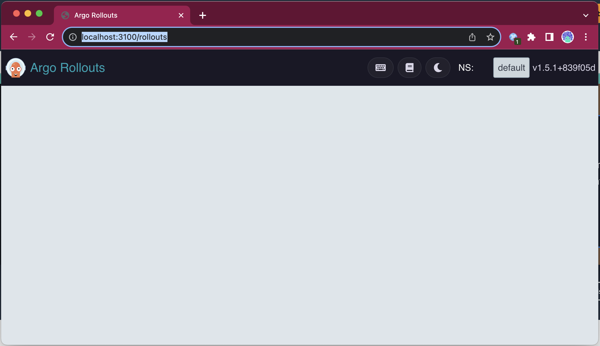
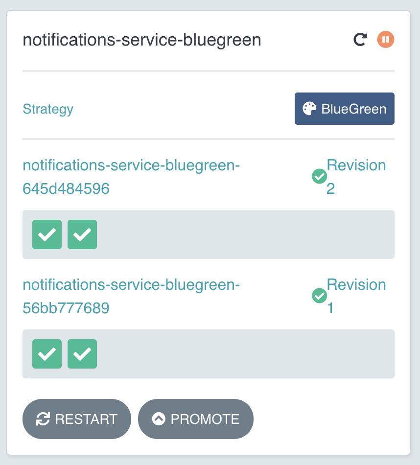

# Argo Rolloutsを使用したリリース戦略

---
_🌍 利用可能な言語_: [English](README.md) | [中文 (Chinese)](README-zh.md) | [日本語 (Japanese)](README-ja.md)

> **注意:** これは素晴らしいクラウドネイティブコミュニティの [🌟 コントリビューター](https://github.com/salaboy/platforms-on-k8s/graphs/contributors) によってもたらされました！

---

このチュートリアルでは、Argo Rolloutsの組み込みメカニズムを使用してリリース戦略を実装する方法を見ていきます。また、ターミナル（`kubectl`）を使用せずに新しいバージョンをプロモートできるArgo Rolloutsダッシュボードについても見ていきます。

## インストール

[Argo Rollouts](https://argoproj.github.io/rollouts/)をインストールするには、Kubernetesクラスターが必要です。[第2章](https://github.com/salaboy/platforms-on-k8s/blob/main/chapter-2/README-ja.md#kindでローカルクラスターを作成する)で行ったように、Kubernetes KinDを使用してクラスターを作成できます。

クラスターができたら、次のコマンドを実行してArgo Rolloutsをインストールできます：

```shell
kubectl create namespace argo-rollouts
kubectl apply -n argo-rollouts -f https://github.com/argoproj/argo-rollouts/releases/latest/download/install.yaml
```

または、[ここにある公式ドキュメント](https://argoproj.github.io/argo-rollouts/installation/#controller-installation)に従ってインストールできます。

また、[Argo Rollouts `kubectl`プラグイン](https://argoproj.github.io/argo-rollouts/installation/#kubectl-plugin-installation)もインストールする必要があります。

プラグインをインストールしたら、新しいターミナルで次のコマンドを実行して、Argo Rolloutsダッシュボードのローカルバージョンを起動できます：

```shell
kubectl argo rollouts dashboard
```

その後、ブラウザで[http://localhost:3100/rollouts](http://localhost:3100/rollouts)にアクセスしてダッシュボードを表示できます。



## カナリアリリース

Conference ApplicationのNotification Serviceにカナリアリリースを実装するためのArgo Rolloutリソースを作成しましょう。[完全な定義はこちら](canary-release/rollout.yaml)にあります。

```yaml
apiVersion: argoproj.io/v1alpha1
kind: Rollout
metadata:
  name: notifications-service-canary
spec:
  replicas: 3
  strategy:
    canary:
      steps:
      - setWeight: 25
      - pause: {}
      - setWeight: 75
      - pause: {duration: 10}
  revisionHistoryLimit: 2
  selector:
    matchLabels:
      app: notifications-service
  template:
    metadata:
      labels:
        app: notifications-service
    spec:
      containers:
      - name: notifications-service
        image: salaboy/notifications-service-0e27884e01429ab7e350cb5dff61b525:v1.0.0
        env: 
          - name: KAFKA_URL
            value: kafka.default.svc.cluster.local
          ... 
        ports:
        - name: http
          containerPort: 8080
          protocol: TCP
        resources:
          limits:
            cpu: "1"
            memory: 256Mi
          requests:
            cpu: "0.1"
            memory: 256Mi
```

`Rollout`リソースはKubernetesの`Deployment`リソースを置き換えます。つまり、Notification Serviceインスタンスにトラフィックをルーティングするために、Kubernetes ServiceとIngressリソースを作成する必要があります。Notification Serviceに3つのレプリカを定義していることに注意してください。

前述の`Rollout`は2つのステップでカナリアリリースを定義しています：

```yaml
strategy:
    canary:
      steps:
      - setWeight: 25
      - pause: {}
      - setWeight: 75
      - pause: {duration: 10}
```

最初、トラフィック分割を25パーセントに設定し、チームが新バージョンをテストするのを待ちます（`pause`ステップ）。その後、手動でロールアウトを続行するよう指示すると、新バージョンへのトラフィックが75パーセントに移動し、最後に10秒間一時停止してから100パーセントに移動します。

`canary-release/`ディレクトリにあるRollout、Service、Ingressリソースを適用する前に、Notification Serviceが接続するためのKafkaをインストールしましょう。

```shell
helm install kafka oci://registry-1.docker.io/bitnamicharts/kafka --version 22.1.5 --set "provisioning.topics[0].name=events-topic" --set "provisioning.topics[0].partitions=1" --set "persistence.size=1Gi" 
```

Kafkaが実行されたら、`canary-releases/`ディレクトリ内のすべてのリソースを適用しましょう：

```shell
kubectl apply -f canary-release/
```

argo rolloutsプラグインを使用して、ターミナルからロールアウトを監視できます：

```shell
kubectl argo rollouts get rollout notifications-service-canary --watch
```

次のような表示が見られるはずです：

```shell
Name:            notifications-service-canary
Namespace:       default
Status:          ✔ Healthy
Strategy:        Canary
  Step:          4/4
  SetWeight:     100
  ActualWeight:  100
Images:          salaboy/notifications-service-0e27884e01429ab7e350cb5dff61b525:v1.0.0 (stable)
Replicas:
  Desired:       3
  Current:       3
  Updated:       3
  Ready:         3
  Available:     3

NAME                                                      KIND        STATUS     AGE  INFO
⟳ notifications-service-canary                            Rollout     ✔ Healthy  80s  
└──# revision:1                                                                       
   └──⧉ notifications-service-canary-7f6b88b5fb           ReplicaSet  ✔ Healthy  80s  stable
      ├──□ notifications-service-canary-7f6b88b5fb-d86s2  Pod         ✔ Running  80s  ready:1/1
      ├──□ notifications-service-canary-7f6b88b5fb-dss5c  Pod         ✔ Running  80s  ready:1/1
      └──□ notifications-service-canary-7f6b88b5fb-tw8fj  Pod         ✔ Running  80s  ready:1/1
```

ご覧のように、Rolloutsを作成したばかりなので、3つのレプリカが作成され、すべてのトラフィックがこの初期の`revision:1`にルーティングされ、ステータスは`Healthy`に設定されています。

Notification Serviceのバージョンを`v1.1.0`に更新しましょう：

```shell
kubectl argo rollouts set image notifications-service-canary \
  notifications-service=salaboy/notifications-service-0e27884e01429ab7e350cb5dff61b525:v1.1.0
```

これで2番目のリビジョン（revision:2）が作成されたのが分かります：

```shell
Name:            notifications-service-canary
Namespace:       default
Status:          ॥ Paused
Message:         CanaryPauseStep
Strategy:        Canary
  Step:          1/4
  SetWeight:     25
  ActualWeight:  25
Images:          salaboy/notifications-service-0e27884e01429ab7e350cb5dff61b525:v1.0.0 (stable)
                 salaboy/notifications-service-0e27884e01429ab7e350cb5dff61b525:v1.1.0 (canary)
Replicas:
  Desired:       3
  Current:       4
  Updated:       1
  Ready:         4
  Available:     4

NAME                                                      KIND        STATUS     AGE    INFO
⟳ notifications-service-canary                            Rollout     ॥ Paused   4m29s  
├──# revision:2                                                                         
│  └──⧉ notifications-service-canary-68fd6b4ff9           ReplicaSet  ✔ Healthy  14s    canary
│     └──□ notifications-service-canary-68fd6b4ff9-jrjxh  Pod         ✔ Running  14s    ready:1/1
└──# revision:1                                                                         
   └──⧉ notifications-service-canary-7f6b88b5fb           ReplicaSet  ✔ Healthy  4m29s  stable
      ├──□ notifications-service-canary-7f6b88b5fb-d86s2  Pod         ✔ Running  4m29s  ready:1/1
      ├──□ notifications-service-canary-7f6b88b5fb-dss5c  Pod         ✔ Running  4m29s  ready:1/1
      └──□ notifications-service-canary-7f6b88b5fb-tw8fj  Pod         ✔ Running  4m29s  ready:1/1
```

now、ロールアウトはステップ1で停止し、トラフィックの25パーセントのみが`revision:2`にルーティングされ、ステータスは`Pause`に設定されています。

`service/info`エンドポイントにリクエストを送信して、どのバージョンが応答しているかを確認してみてください：

```shell
curl localhost/service/info
```

おおよそ4回に1回のリクエストは`v1.1.0`によって応答されるはずです：

```shell
> curl localhost/service/info | jq

{
    "name":"NOTIFICATIONS",
    "version":"1.0.0",
    "source":"https://github.com/salaboy/platforms-on-k8s/tree/main/conference-application/notifications-service",
    "podName":"notifications-service-canary-7f6b88b5fb-tw8fj",
    "podNamespace":"default",
    "podNodeName":"dev-worker2",
    "podIp":"10.244.3.3",
    "podServiceAccount":"default"
}

> curl localhost/service/info | jq

{
    "name":"NOTIFICATIONS",
    "version":"1.0.0",
    "source":"https://github.com/salaboy/platforms-on-k8s/tree/main/conference-application/notifications-service",
    "podName":"notifications-service-canary-7f6b88b5fb-tw8fj",
    "podNamespace":"default",
    "podNodeName":"dev-worker2",
    "podIp":"10.244.3.3",
    "podServiceAccount":"default"
}

> curl localhost/service/info | jq

{
    "name":"NOTIFICATIONS-IMPROVED",
    "version":"1.1.0",
    "source":"https://github.com/salaboy/platforms-on-k8s/tree/v1.1.0/conference-application/notifications-service",
    "podName":"notifications-service-canary-68fd6b4ff9-jrjxh",
    "podNamespace":"default",
    "podNodeName":"dev-worker",
    "podIp":"10.244.2.4",
    "podServiceAccount":"default"
}

> curl localhost/service/info | jq

{
    "name":"NOTIFICATIONS",
    "version":"1.0.0",
    "source":"https://github.com/salaboy/platforms-on-k8s/tree/main/conference-application/notifications-service",
    "podName":"notifications-service-canary-7f6b88b5fb-tw8fj",
    "podNamespace":"default",
    "podNodeName":"dev-worker2",
    "podIp":"10.244.3.3",
    "podServiceAccount":"default"
}
```

また、Argo Rolloutsダッシュボードを確認してください。カナリアリリースが表示されているはずです：


promoteコマンドまたはダッシュボードのPromoteボタンを使用して、カナリアを前進させることができます。コマンドは次のようになります：

```shell
kubectl argo rollouts promote notifications-service-canary
```

これにより、カナリアのトラフィックが75%に移動し、さらに10秒後に100%になるはずで。最後の一時停止ステップは10秒間だけだからです。ターミナルには次のように表示されるはずです：

```shell
Name:            notifications-service-canary
Namespace:       default
Status:          ✔ Healthy
Strategy:        Canary
  Step:          4/4
  SetWeight:     100
  ActualWeight:  100
Images:          salaboy/notifications-service-0e27884e01429ab7e350cb5dff61b525:v1.1.0 (stable)
Replicas:
  Desired:       3
  Current:       3
  Updated:       3
  Ready:         3
  Available:     3

NAME                                                      KIND        STATUS        AGE  INFO
⟳ notifications-service-canary                            Rollout     ✔ Healthy     16m  
├──# revision:2                                                                          
│  └──⧉ notifications-service-canary-68fd6b4ff9           ReplicaSet  ✔ Healthy     11m  stable
│     ├──□ notifications-service-canary-68fd6b4ff9-jrjxh  Pod         ✔ Running     11m  ready:1/1
│     ├──□ notifications-service-canary-68fd6b4ff9-q4zgj  Pod         ✔ Running     51s  ready:1/1
│     └──□ notifications-service-canary-68fd6b4ff9-fctjv  Pod         ✔ Running     46s  ready:1/1
└──# revision:1                                                                          
   └──⧉ notifications-service-canary-7f6b88b5fb           ReplicaSet  • ScaledDown  16m  
```

そしてダッシュボードでは：


これで、すべてのリクエストが`v1.1.0`によって応答されるはずです：

```shell
> curl localhost/service/info

{
    "name":"NOTIFICATIONS-IMPROVED",
    "version":"1.1.0",
    "source":"https://github.com/salaboy/platforms-on-k8s/tree/v1.1.0/conference-application/notifications-service",
    "podName":"notifications-service-canary-68fd6b4ff9-jrjxh",
    "podNamespace":"default",
    "podNodeName":"dev-worker",
    "podIp":"10.244.2.4",
    "podServiceAccount":"default"
}

> curl localhost/service/info

{
    "name":"NOTIFICATIONS-IMPROVED",
    "version":"1.1.0",
    "source":"https://github.com/salaboy/platforms-on-k8s/tree/v1.1.0/conference-application/notifications-service",
    "podName":"notifications-service-canary-68fd6b4ff9-jrjxh",
    "podNamespace":"default",
    "podNodeName":"dev-worker",
    "podIp":"10.244.2.4",
    "podServiceAccount":"default"
}

> curl localhost/service/info

{
    "name":"NOTIFICATIONS-IMPROVED",
    "version":"1.1.0",
    "source":"https://github.com/salaboy/platforms-on-k8s/tree/v1.1.0/conference-application/notifications-service",
    "podName":"notifications-service-canary-68fd6b4ff9-jrjxh",
    "podNamespace":"default",
    "podNodeName":"dev-worker",
    "podIp":"10.244.2.4",
    "podServiceAccount":"default"
}
```

ブルー/グリーンデプロイメントに進む前に、次のコマンドを実行してカナリアロールアウトをクリーンアップしましょう：

```shell
kubectl delete -f canary-release/
```

## ブルー/グリーンデプロイメント

ブルー/グリーンデプロイメントでは、サービスの2つのバージョンを同時に実行したいと考えます。ブルー（アクティブ）バージョンはすべてのユーザーがアクセスし、グリーン（プレビュー）バージョンは内部チームが新機能と変更をテストするために使用します。

Argo Rolloutsは、ブルーグリーン戦略をすぐに使用できる形で提供しています：

```yaml
apiVersion: argoproj.io/v1alpha1
kind: Rollout
metadata:
  name: notifications-service-bluegreen
spec:
  replicas: 2
  revisionHistoryLimit: 2
  selector:
    matchLabels:
      app: notifications-service
  template:
    metadata:
      labels:
        app: notifications-service
    spec:
      containers:
      - name: notifications-service
        image: salaboy/notifications-service-0e27884e01429ab7e350cb5dff61b525:v1.0.0
        env: 
          - name: KAFKA_URL
            value: kafka.default.svc.cluster.local
          ..
  strategy:
    blueGreen: 
      activeService: notifications-service-blue
      previewService: notifications-service-green
      autoPromotionEnabled: false
```

再び、Rolloutメカニズムをテストするために通知サービスを使用しています。ここでは、通知サービスのブルー/グリーンデプロイメントを定義しており、2つの既存Kubernetesサービス（`notifications-service-blue`と`notifications-service-green`）を指定しています。`autoPromotionEnabled`フラグが`false`に設定されていることに注意してください。これにより、新しいバージョンが準備できたときに自動的にプロモーションが行われるのを防ぎます。

前のセクション（カナリアリリース）からKafkaがすでに実行されていることを確認し、`blue-green/`ディレクトリ内のすべてのリソースを適用します：

```shell
kubectl apply -f blue-green/
```

これにより、`Rollout`リソース、2つのKubernetesサービス、2つのIngressリソースが作成されます。1つはBlueサービス用で`/`からトラフィックを転送し、もう1つはGreenサービス用で`/preview/`からトラフィックを転送します。

ターミナルで次のコマンドを実行して、Rolloutを監視できます：

```shell
kubectl argo rollouts get rollout notifications-service-bluegreen --watch
```

次のような表示が見られるはずです：

```
Name:            notifications-service-bluegreen
Namespace:       default
Status:          ✔ Healthy
Strategy:        BlueGreen
Images:          salaboy/notifications-service-0e27884e01429ab7e350cb5dff61b525:v1.0.0 (stable, active)
Replicas:
  Desired:       2
  Current:       2
  Updated:       2
  Ready:         2
  Available:     2

NAME                                                         KIND        STATUS     AGE    INFO
⟳ notifications-service-bluegreen                            Rollout     ✔ Healthy  3m16s  
└──# revision:1                                                                            
   └──⧉ notifications-service-bluegreen-56bb777689           ReplicaSet  ✔ Healthy  2m56s  stable,active
      ├──□ notifications-service-bluegreen-56bb777689-j5ntk  Pod         ✔ Running  2m56s  ready:1/1
      └──□ notifications-service-bluegreen-56bb777689-qzg9l  Pod         ✔ Running  2m56s  ready:1/1
```

通知サービスの2つのレプリカが稼働しています。`localhost/service/info`にcurlを実行すると、通知サービス`v1.0.0`の情報が得られるはずです：

```shell
> curl localhost/service/info | jq

{
    "name":"NOTIFICATIONS",
    "version":"1.0.0",
    "source":"https://github.com/salaboy/platforms-on-k8s/tree/main/conference-application/notifications-service",
    "podName":"notifications-service-canary-7f6b88b5fb-tw8fj",
    "podNamespace":"default",
    "podNodeName":"dev-worker2",
    "podIp":"10.244.3.3",
    "podServiceAccount":"default"
}
```

Argo Rolloutsダッシュボードにも、ブルー/グリーンロールアウトが表示されているはずです：


カナリアリリースと同様に、Rollout設定を更新できます。この場合、バージョン`v1.1.0`のイメージを設定します。

```shell
kubectl argo rollouts set image notifications-service-bluegreen \
  notifications-service=salaboy/notifications-service-0e27884e01429ab7e350cb5dff61b525:v1.1.0
```

これで、ターミナルに通知サービスの両バージョンが並行して実行されているのが表示されるはずです：

```shell
Name:            notifications-service-bluegreen
Namespace:       default
Status:          ॥ Paused
Message:         BlueGreenPause
Strategy:        BlueGreen
Images:          salaboy/notifications-service-0e27884e01429ab7e350cb5dff61b525:v1.0.0 (stable, active)
                 salaboy/notifications-service-0e27884e01429ab7e350cb5dff61b525:v1.1.0 (preview)
Replicas:
  Desired:       2
  Current:       4
  Updated:       2
  Ready:         2
  Available:     2

NAME                                                         KIND        STATUS     AGE    INFO
⟳ notifications-service-bluegreen                            Rollout     ॥ Paused   8m54s  
├──# revision:2                                                                            
│  └──⧉ notifications-service-bluegreen-645d484596           ReplicaSet  ✔ Healthy  16s    preview
│     ├──□ notifications-service-bluegreen-645d484596-ffhsm  Pod         ✔ Running  16s    ready:1/1
│     └──□ notifications-service-bluegreen-645d484596-g2zr4  Pod         ✔ Running  16s    ready:1/1
└──# revision:1                                                                            
   └──⧉ notifications-service-bluegreen-56bb777689           ReplicaSet  ✔ Healthy  8m34s  stable,active
      ├──□ notifications-service-bluegreen-56bb777689-j5ntk  Pod         ✔ Running  8m34s  ready:1/1
      └──□ notifications-service-bluegreen-56bb777689-qzg9l  Pod         ✔ Running  8m34s  ready:1/1
```

`v1.0.0`と`v1.1.0`の両方が実行中で健全ですが、ブルー/グリーンロールアウトのステータスは一時停止中です。これは、`preview`/`green`バージョンの検証を担当するチーがプライムタイムの準備ができるまで、両方のバージョンを実行し続けるためです。

Argo Rolloutsダッシュボードを確認してください。両方のバージョンが実行されているのが表示されるはずです：



この時点で、定義したIngressルートを使用して両方のサービスにリクエストを送信できます。`localhost/service/info`にcurlを実行してBlueサービス（安定版サービス）にヒットし、`localhost/preview/service/info`にcurlを実行してGreenサービス（プレビューサービス）にヒットできます。

```shell
> curl localhost/service/info

{
    "name":"NOTIFICATIONS",
    "version":"1.0.0",
    "source":"https://github.com/salaboy/platforms-on-k8s/tree/main/conference-application/notifications-service",
    "podName":"notifications-service-canary-7f6b88b5fb-tw8fj",
    "podNamespace":"default",
    "podNodeName":"dev-worker2",
    "podIp":"10.244.3.3",
    "podServiceAccount":"default"
}
```

次に、Greenサービスを確認しましょう：

```shell
> curl localhost/green/service/info

{
    "name":"NOTIFICATIONS-IMPROVED",
    "version":"1.1.0",
    "source":"https://github.com/salaboy/platforms-on-k8s/tree/v1.1.0/conference-application/notifications-service",
    "podName":"notifications-service-canary-68fd6b4ff9-jrjxh",
    "podNamespace":"default",
    "podNodeName":"dev-worker",
    "podIp":"10.244.2.4",
    "podServiceAccount":"default"
}
```

結果に満足できれば、Greenサービスを新しい安定版サービスにプロモートできます。これは、Argo Rolloutsダッシュボードの「Promote」ボタンをクリックするか、次のコマンドを実行することで行います：

```shell
kubectl argo rollouts promote notifications-service-bluegreen
```

ターミナルには次のように表示されるはずです：

```shell
Name:            notifications-service-bluegreen
Namespace:       default
Status:          ✔ Healthy
Strategy:        BlueGreen
Images:          salaboy/notifications-service-0e27884e01429ab7e350cb5dff61b525:v1.0.0
                 salaboy/notifications-service-0e27884e01429ab7e350cb5dff61b525:v1.1.0 (stable, active)
Replicas:
  Desired:       2
  Current:       4
  Updated:       2
  Ready:         2
  Available:     2

NAME                                                         KIND        STATUS     AGE    INFO
⟳ notifications-service-bluegreen                            Rollout     ✔ Healthy  2m44s  
├──# revision:2                                                                            
│  └──⧉ notifications-service-bluegreen-645d484596           ReplicaSet  ✔ Healthy  2m27s  stable,active
│     ├──□ notifications-service-bluegreen-645d484596-fnbg7  Pod         ✔ Running  2m27s  ready:1/1
│     └──□ notifications-service-bluegreen-645d484596-ntcbf  Pod         ✔ Running  2m27s  ready:1/1
└──# revision:1                                                                            
   └──⧉ notifications-service-bluegreen-56bb777689           ReplicaSet  ✔ Healthy  2m44s  delay:9s
      ├──□ notifications-service-bluegreen-56bb777689-k6qxk  Pod         ✔ Running  2m44s  ready:1/1
      └──□ notifications-service-bluegreen-56bb777689-vzsw7  Pod         ✔ Running  2m44s  ready:1/1
```

これで安定版サービスは`revision:2`になりました。Argo Rolloutsは`revision:1`をしばらくアクティブなままにしておくことがわかります。これは、戻す必要がある場合に備えてですが、数秒後にはダウンスケールされます。

ダッシュボードを確認して、ロールアウトが`revision:2`になっていることを確認してください：


ここまで到達できれば、Argo Rolloutsを使用してカナリアリリースとブルー/グリーンデプロイメントを実装したことになります！

## クリーンアップ

このチュートリアル用に作成したKinDクラスターを削除したい場合は、次のコマンドを実行できます：

```shell
kind delete clusters dev
```
