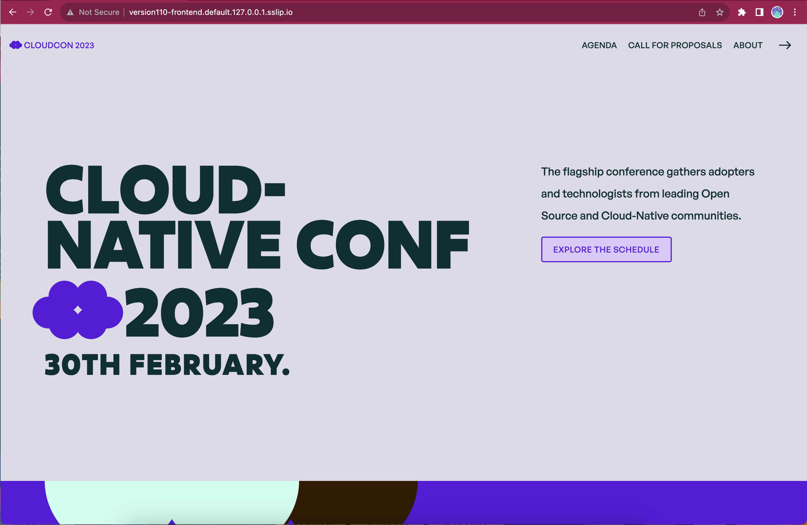

# Knative Servingを使用したリリース戦略

---
_🌍 利用可能な言語_: [English](README.md) | [中文 (Chinese)](README-zh.md) | [日本語 (Japanese)](README-ja.md)

> **注意:** これは素晴らしいクラウドネイティブコミュニティの [🌟 コントリビューター](https://github.com/salaboy/platforms-on-k8s/graphs/contributors) によってもたらされました！

---

このチュートリアルでは、Kubernetesクラスターを作成し、Knative Servingをインストールして、異なるリリース戦略を実装します。Knative Servingのパーセンテージベースのトラフィック分割、タグベースのルーティング、ヘッダーベースのルーティングを使用します。

## Knative Servingを使用したKubernetesの作成

[Knative Serving](https://knative.dev)をインストールするには、Kubernetesクラスターが必要です。Kubernetes KinDを使用してクラスターを作成できますが、第2章で提供された設定を使用する代わりに、以下のコマンドを使用します：

```shell
cat <<EOF | kind create cluster --name dev --config=-
kind: Cluster
apiVersion: kind.x-k8s.io/v1alpha4
nodes:
- role: control-plane
  extraPortMappings:
  - containerPort: 31080 # ノードのポート31380をホストのポート80に公開し、後でkourierまたはcontour ingressで使用
    listenAddress: 127.0.0.1
    hostPort: 80
EOF
```

Knative Servingを使用する場合、Ingressコントローラーをインストールする必要はありません。Knative Servingはトラフィックルーティングと分割などの機能を有効にするために、より高度なネットワークスタックを必要とします。このために[Kourier](https://github.com/knative-extensions/net-kourier)をインストールしますが、[Istio](https://istio.io/)のような完全なサービスメッシュをインストールすることもできます。

クラスターができたら、[Knative Serving](https://knative.dev/docs/install/yaml-install/serving/install-serving-with-yaml/)のインストールから始めましょう。公式ドキュメントに従うか、ここにリストされているインストール手順をコピーできます。これらの例は、このバージョンのKnativeでテストされています。

Knative Servingカスタムリソース定義をインストールします：

```shell
kubectl apply -f https://github.com/knative/serving/releases/download/knative-v1.10.2/serving-crds.yaml
```

次に、Knative Servingコントロールプレーンをインストールします：
```shell
kubectl apply -f https://github.com/knative/serving/releases/download/knative-v1.10.2/serving-core.yaml
```

互換性のあるKnative Servingネットワークスタックをインストールします。ここでは、Istio（フル機能のサービスメッシュ）や、クラスター上のリソース使用量を制限するためにここで使用するKourierのようなよりシンプルなオプションをインストールできます：

```shell
kubectl apply -f https://github.com/knative/net-kourier/releases/download/knative-v1.10.0/kourier.yaml
```

Kourierを選択されたネットワークスタックとして設定します：

```shell
kubectl patch configmap/config-network \
  --namespace knative-serving \
  --type merge \
  --patch '{"data":{"ingress-class":"kourier.ingress.networking.knative.dev"}}'
```

最後に、クラスターのDNS解決を設定し、サービスに到達可能なURLを公開できるようにします：

```shell
kubectl apply -f https://github.com/knative/serving/releases/download/knative-v1.10.2/serving-default-domain.yaml
```

**KnativeをKinDで使用する場合のみ**

KinDでKnative Magic DNSを機能させるには、以下のConfigMapにパッチを適用する必要があります：

```shell
kubectl patch configmap -n knative-serving config-domain -p "{\"data\": {\"127.0.0.1.sslip.io\": \"\"}}"
```

`kourier`ネットワークレイヤーをインストールした場合は、ingressを作成する必要があります：

```shell
cat <<EOF | kubectl apply -f -
apiVersion: v1
kind: Service
metadata:
  name: kourier-ingress
  namespace: kourier-system
  labels:
    networking.knative.dev/ingress-provider: kourier
spec:
  type: NodePort
  selector:
    app: 3scale-kourier-gateway
  ports:
    - name: http2
      nodePort: 31080
      port: 80
      targetPort: 8080
EOF
```

次のセクションで説明する例を実行するには、もう1つのステップが必要です。それは、`tag-header-based-routing`を有効にし、クラスターで実行されているポッドに関する情報を取得するための[Kubernetes Downward API](https://knative.dev/docs/serving/configuration/feature-flags/#kubernetes-downward-api)へのアクセスを有効にすることです。config-features ConfigMap（https://knative.dev/docs/serving/configuration/feature-flags/#feature-and-extension-flags）にパッを適用して、Knative Servingのインストールを調整できます：

```shell
kubectl patch cm config-features -n knative-serving -p '{"data":{"tag-header-based-routing":"Enabled", "kubernetes.podspec-fieldref": "Enabled"}}'
```

これらの設定の後、KinDクラスター上でKnative Servingを使用する準備が整ったはずです。

# Knative Servingを使用したリリース戦略

異なるリリース戦略の実装に飛び込む前に、Knative Servingの基本を理解する必要があります。そのために、Notification ServiceのKnative Serviceを定義してみましょう。これにより、Knative Servingとその機能の使用に関する実践的な経験が得られます。

## Knative Servicesの簡単な紹介

Knative Servingは、`Knative Service`の概念を使用して、Kubernetesが提供する機能を簡素化し拡張します。`Knative Service`は、Knative Servingネットワークレイヤーを使用して、複雑なKubernetesリソースを義することなく、ワークロードにトラフィックをルーティングします。Knative Servingはサービスへのトラフィックの流れに関する情報にアクセスできるため、サービスが経験している負荷を理解し、目的に合わせて構築された自動スケーラーを使用して、需要に基づいてサービスインスタンスをアップスケールまたはダウンスケールできます。これは、Function-as-a-Serviceモデルを実装しようとしているプラットフォームチームにとって非常に有用で、Knative Servingはトラフィックを受信していないサービスをゼロにダウンスケールできます。

Knative Servicesは、Google Cloud Run、Azure Container Apps、AWS App Runnerなどのコンテナサービスモデルに似た簡略化された設定も公開しており、実行したいコンテナを定義するだけで、プラットフォームが残りの部分（ネットワーキン、トラフィックルーティングなどの複雑な設定なし）を処理します。

Notifications Serviceはイベントの発行にKafkaを使用しているため、Helmを使用してKafkaをインストールする必要があります：

```shell
helm install kafka oci://registry-1.docker.io/bitnamicharts/kafka --version 22.1.5 --set "provisioning.topics[0].name=events-topic" --set "provisioning.topics[0].partitions=1" --set "persistence.size=1Gi" 
```

続行する前に、Kafkaが実行されていることを確認してください。通常、Kafkaコンテナイメージのフェッチと起動に少し時間がかかります。

Knative Servingがインストールされたクラスターがある場合、以下のKnative Serviceリソースを適用して、Notifications Serviceのインスタンスを実行できます：

```yaml
apiVersion: serving.knative.dev/v1
kind: Service
metadata:
  name: notifications-service 
spec:
  template:
    spec:
      containers:
        - image: salaboy/notifications-service-0e27884e01429ab7e350cb5dff61b525:v1.0.0
          env:
          - name: KAFKA_URL
            value: kafka.default.svc.cluster.local
          ...<その他の環境変数はここに>...  
```

以下のコマンドを実行してこのリソースを適用できます：

```shell
kubectl apply -f knative/notifications-service.yaml
```

Knative Servingは、コンテナのインスタンスを作成し、サービスにアクセスするためのURLを提供するために必要なすべてのネットワーク設定をセットアップします。

以下のコマンドを実行して、実行中のすべてのKnative Servicesをリストできます：

```shell
> kubectl get ksvc 
NAME                    URL                                                       LATESTCREATED                 LATESTREADY                   READY   REASON
notifications-service   http://notifications-service.default.127.0.0.1.sslip.io   notifications-service-00001   notifications-service-00001   True    
```

サービスが動作していることを確認するために、サービスの`service/info` URLにcurlを実行できます。出力を整形するために人気のあるJSONユーティリティ[`jq`](https://jqlang.github.io/jq/download/)を使用しています：

```shell
curl http://notifications-service.default.127.0.0.1.sslip.io/service/info | jq 
```

以下のような出力が表示されるはずです：

```json
{
    "name": "NOTIFICATIONS",
    "podIp": "10.244.0.16",
    "podName": "notifications-service-00001-deployment-7ff76b4c77-qkk69",
    "podNamespace": "default",
    "podNodeName": "dev-control-plane",
    "podServiceAccount": "default",
    "source": "https://github.com/salaboy/platforms-on-k8s/tree/main/conference-application/notifications-service",
    "version": "1.0.0"
}
```

コンテナを実行しているポッドが存在することを確認してください：

```shell
> kubectl get pods
NAME                                                      READY   STATUS    RESTARTS   AGE
kafka-0                                                   1/1     Running   0          7m54s
notifications-service-00001-deployment-798f8f79f5-jrbr8   2/2     Running   0          4s
```

2つのコンテナが実行されていることに注意してください。1つは通知サービスで、もう1つはKnative Servingの`queue`プロキシで、これは受信リクエストをバッファリングし、トラフィックメトリクスを取得するために使用されます。

デフォルトでは90秒後、通知サービスにリクエストを送信していない場合、サービスインスタンスは自動的にダウンスケールされます。新しい受信リクエストが到着すると、Knative Servingは自動的にサービスをアップスケールし、インスタンスが準備できるまでリクエストをバッファリングします。

まとめると、Knative Servingを使用することで、すぐに2つのことが得られす：
- 複数のKubernetesリソースを作成せずにワークロードを実行する簡略化された方法。このアプローチは、プラットフォームチームがチームに提供したいと考えるかもしれないContainer-as-a-Serviceオファリングに似ています。
- Knative Autoscalerを使用したダイナミックな自動スケーリング。これは、使用されていないときにアプリケーションをゼロにダウンスケールするために使用できます。これは、プラットフォームチームがチームに提供したいと考えるかもしれないFunctions-as-a-Serviceアプローチに似ています。

## Knative ServicesでConferenceアプリケーションを実行する

このセクションでは、Conferenceアプリケーションの異なるリリース戦略を実装する方法を見ていきます。そのために、他のアプリケーションサービスもKnative Servicesを使用してデプロイします。

のサービスをインストールする前に、すでにKafkaをインストールしたように、PostgreSQLとRedisをセットアップする必要があります。PostgreSQLをインストールする前に、SQLステートメントを含むConfigMapを作成し、`Proposals`テーブルを作成する必要があります。これにより、HelmチャートがconfigMapを参照し、データベースインスタンスが起動されたときにステートメントを実行できます。

```shell
kubectl apply -f knative/c4p-sql-init.yaml
```

```shell
helm install postgresql oci://registry-1.docker.io/bitnamicharts/postgresql --version 12.5.7 --set "image.debug=true" --set "primary.initdb.user=postgres" --set "primary.initdb.password=postgres" --set "primary.initdb.scriptsConfigMap=c4p-init-sql" --set "global.postgresql.auth.postgresPassword=postgres" --set "primary.persistence.size=1Gi"
```

そしてRedis：

```shell
helm install redis oci://registry-1.docker.io/bitnamicharts/redis --version 17.11.3 --set "architecture=standalone" --set "master.persistence.size=1Gi"
```

これで、以下のコマンドを実行して、他のすべてのサービス（frontend、c4p-service、agenda-service）をインストールできます：

```shell
kubectl apply -f knative/
```

すべてのKnative Servicesが`READY`であることを確認してください：

```shell
> kubectl get ksvc
NAME                    URL                                                       LATESTCREATED                 LATESTREADY                   READY   REASON
agenda-service          http://agenda-service.default.127.0.0.1.sslip.io          agenda-service-00001          agenda-service-00001          True    
c4p-service             http://c4p-service.default.127.0.0.1.sslip.io             c4p-service-00001             c4p-service-00001             True    
frontend                http://frontend.default.127.0.0.1.sslip.io                frontend-00001                frontend-00001                True    
notifications-service   http://notifications-service.default.127.0.0.1.sslip.io   notifications-service-00001   notifications-service-00001   True    
```

Conference Applicationのフロントエンドにアクセスするには、ブラウザで次のURLにアクセスしてください：[http://frontend.default.127.0.0.1.sslip.io](http://frontend.default.127.0.0.1.sslip.io)

この時点で、アプリケーションは期待通りに動作するはずですが、小さな違いがあります。Agenda ServiceやC4P Serviceなどのサービスは、使用されていない場合にダウンスケールされます。90秒間の非アクティブ状態の後にポッドをリストすると、以下のように表示されるはずです：

```shell
> kubectl get pods 
NAME                                                     READY   STATUS    RESTARTS   AGE
frontend-00002-deployment-7fdfb7b8c5-cw67t               2/2     Running   0          60s
kafka-0                                                  1/1     Running   0          20m
notifications-service-00002-deployment-c5787bc49-flcc9   2/2     Running   0          60s
postgresql-0                                             1/1     Running   0          9m23s
redis-master-0                                           1/1     Running   0          8m50s
```

AgendaサービスとC4Pサービスは永続ストレージ（RedisとPostgreSQL）にデータを保存しているため、サービスインスタンスがダウンスケールされてもデータは失われません。しかし、NotificationsサービスとFrontendサービスはインメモリデータ（通知と消費されたイベント）を保持しているため、少なくとも1つのインスタンスを常に稼働させるようにKnativeサービスを設定しています。このようなインメモリ状態の保持は、アプリケーションのスケーリング方法に影響しますが、これはただのウォーキングスケルトンであることを覚えておいてください。

アプリケーションが稼働したので、いくつかの異なるリリース戦略を見てみましょう。

# カナリアリリース

このセクションでは、Knative Servicesを使用してカナリアリリースを行う簡単な例を実行しま。まず、パーセンテージベースのトラフィック分割を見ていきます。

パーセンテージベースのトラフィック分割機能は、Knative Servicesによってすぐに使用できます。フロントエンドを変更する代わりに、以前にデプロイした通知サービスを更新します。CSSやJavaScriptファイルを取得するための複数のリクエストを扱うと、パーセンテージベースのトラフィック分割を使用する際に複雑になる可能性があるためです。

サービスがまだ稼働していることを確認するために、次のコマンドを実行できます：

```shell
curl http://notifications-service.default.127.0.0.1.sslip.io/service/info | jq
```

以下のような出力が表示されるはずです：

```json
{
    "name": "NOTIFICATIONS",
    "podIp": "10.244.0.16",
    "podName": "notifications-service-00001-deployment-7ff76b4c77-qkk69",
    "podNamespace": "default",
    "podNodeName": "dev-control-plane",
    "podServiceAccount": "default",
    "source": "https://github.com/salaboy/platforms-on-k8s/tree/main/conference-application/notifications-service",
    "version": "1.0.0"
}
```

通知サービスのKnative Service（`ksvc`）を編集し、サービスが使用しているコンテナイメージを変更するか、環境変数などの他の設定パラメータを変更することで、新しいリビジョンを作成できます：

```shell
kubectl edit ksvc notifications-service
```

そして、以下から：

```yaml
apiVersion: serving.knative.dev/v1
kind: Service
metadata:
  name: notifications-service 
spec:
  template:
    metadata:
      annotations:
        autoscaling.knative.dev/min-scale: "1"
    spec:
      containers:
        - image: salaboy/notifications-service-0e27884e01429ab7e350cb5dff61b525:v1.0.0  
      ...
```

`v1.1.0`に変更します：

```yaml
apiVersion: serving.knative.dev/v1
kind: Service
metadata:
  name: notifications-service 
spec:
  template:
    metadata:
      annotations:
        autoscaling.knative.dev/min-scale: "1"
    spec:
      containers:
        - image: salaboy/notifications-service-0e27884e01429ab7e350cb5dff61b525:v1.1.0  
      ...
```

この変更を保存する前に、トラフィックを分割するために使用できる新しいリビジョンを作成します。trafficセクションに以下の値を追加する必要があります：

```yaml
 traffic:
  - latestRevision: false
    percent: 50
    revisionName: notifications-service-00001
  - latestRevision: true
    percent: 50
```

これで、再び`service/info`エンドポイントにヒットし始めると、トラフィックの半分がサービスのバージョン`v1.0.0`にルーティングされ、残りの半分がバージョン`v1.1.0`にルーティングされているのがわかります。

```shell
> curl http://notifications-service.default.127.0.0.1.sslip.io/service/info | jq
{
    "name":"NOTIFICATIONS-IMPROVED",
    "version":"1.1.0",
    "source":"https://github.com/salaboy/platforms-on-k8s/tree/v1.1.0/conference-application/notifications-service",
    "podName":"notifications-service-00003-deployment-59fb5bff6c-2gfqt",
    "podNamespace":"default",
    "podNodeName":"dev-control-plane",
    "podIp":"10.244.0.34",
    "podServiceAccount":"default"
}

> curl http://notifications-service.default.127.0.0.1.sslip.io/service/info | jq
{
    "name":"NOTIFICATIONS",
    "version":"1.0.0",
    "source":"https://github.com/salaboy/platforms-on-k8s/tree/main/conference-application/notifications-service",
    "podName":"notifications-service-00001-deployment-7ff76b4c77-h6ts4",
    "podNamespace":"default",
    "podNodeName":"dev-control-plane",
    "podIp":"10.244.0.35",
    "podServiceAccount":"default"
}
```

このメカニズムは、新しいバージョンをテストする必要があるが、問題が発生した場合に備えてすべてのライブトラフィックを直ちに新しいバージョンにルーティングしたくない場に非常に役立ちます。

最新のバージョンが十分に安定していてより多くのトラフィックを受け取れると確信できる場合は、トラフィックルールを変更して異なるパーセンテージ分割にすることができます。

```yaml
 traffic:
  - latestRevision: false
    percent: 10
    revisionName: notifications-service-00001
  - latestRevision: true
    percent: 90
```

1つのリビジョン（バージョン）にトラフィックルールが指定されなくなると、そのインスタンスはダウンスケールされます。トラフィックがルーティングされなくなるためです。

# A/Bテストとブルー/グリーンデプロイメント

A/Bテストでは、同じアプリケーション/サービスの2つ以上のバージョンを同時に実行して、異なるユーザーグループが変更をテストできるようにし、どのバージョンが最も適しているかを決定できるようにします。

Knative Servingでは、`ヘッダーベース`ルーティングと`タグベース`ルーティングの2つのオプションがあります。両方とも背後で同じメカニズムと設定を使用しますが、これらのメカニズムがどのように使用できるかを見てみましょう。

タグ/ヘッダーベースのルーティングでは、リクエストの行き先をより細かく制御できます。HTTPヘッダーや特定のURLを使用して、Knativeネットワーキングメカニズムに特定のバージョンのサービスにトラフィックをルーティングするよう指示できます。

つまり、この例では、アプリケーションのフロントエンドを変更できます。ヘッダーまたは特定のURLを含むすべてのリクエストが、サービスの同じバージョンにルーティングされるためです。

ブラウザで[http://frontend.default.127.0.0.1.sslip.io](http://frontend.default.127.0.0.1.sslip.io)にアクセスして、アプリケーションのフロントエンドにアクセスしていることを確認してください。


次に、デバッグ機能を有効にした新しいバージョンをデプロイするために、フロントエンドのKnative Serviceを変更しましょう：

```shell
kubectl edit ksvc frontend
```

イメージフィールドを`v1.1.0`を指すように更新し、FEATURE_DEBUG_ENABLED環境変数を追加します（OpenFeatureを使用していないアプリケーションの最初のバージョンを使用していることを覚えておいてください）。

```yaml
spec:
      containerConcurrency: 0
      containers:
      - env:
        - name: FEATURE_DEBUG_ENABLED
          value: "true"
       ...
        image: salaboy/frontend-go-1739aa83b5e69d4ccb8a5615830ae66c:v1.1.0
```

Knative Serviceを保存する前に、トラフィックルールを以下のように変更しましょう：

```yaml
traffic:
  - latestRevision: false
    percent: 100
    revisionName: frontend-00001
    tag: current
  - latestRevision: true
    percent: 0
    tag: version110
```

サービスのURLでタグが指定されない限り、`v1.1.0`にトラフィック（percent: 0）がルーティングされないことに注意してください。ユーザーは[http://version110-frontend.default.127.0.0.1.sslip.io](http://version110-frontend.default.127.0.0.1.sslip.io)にアクセスして`v1.1.0`にアクセスできるようになりました。



`v1.1.0`は異なる色のテーマを持っていることに注意してください。並べて見ると違いがわかります。アプリケーションの他のセクションも確認してください。

何らかの理由でサービスのURLを変更したくない、または変更できない場合は、HTTPヘッダーを使用して`v1.1.0`にアクセスできます。[Chrome ModHeader](https://chrome.google.com/webstore/detail/modheader-modify-http-hea/idgpnmonknjnojddfkpgkljpfnnfcklj)のようなブラウザプラグインを使用すると、パラメータやヘッダーを追加することで、ブラウザが送信するすべてのリクエストを変更できます。

ここでは、`Knative-Serving-Tag`ヘッダーに`version110`という値を設定しています。これは、フロントエンドのKnative Serviceのトラフィックルールで設定したタグの名前です。

これで、通常のKnative ServiceのURL（変更なし）にアクセスして`v1.1.0`にアクセスできます：[http://frontend.default.127.0.0.1.sslip.io](http://frontend.default.127.0.0.1.sslip.io)


タグとヘッダーベースのルーティングを使用すると、同じ方法でブルー/グリーンデプロイメントを実装できます。`green`サービス（プライムタイムの準備ができるまでテストしたいサービス）を、0%のトラフィックが割り当てられたタグの背後に隠すことができるためです。

```yaml
traffic:
    - revisionName: <blue-revision-name>
      percent: 100 # すべてのトラフィックはまだこのリビジョンにルーティングされています
    - revisionName: <gree-revision-name>
      percent: 0 # このバージョンに0%のトラフィックがルーティングされます
      tag: green # 名前付きルート
```

`green`サービスに切り替える準備ができたら、トラフィックルールを変更できます：

```yaml
traffic:
    - revisionName: <blue-revision-name>
      percent: 0 
      tag: blue 
    - revisionName: <gree-revision-name>
      percent: 100
```

まとめると、Knative Servicesのトラフィック分割とヘッダー/タグベースのルーティング機能を使用して、カナリアリリース、A/Bテストパターン、およびブルー/グリーンデプロイメントを実装しました。プロジェクトの詳細については、[Knative ウェブサイト](https://knative.dev)をチェックしてください。

## クリーンアップ

このチュートリアル用に作成したKinDクラスターを削除したい場合は、次のコマンドを実行できます：

```shell
kind delete clusters dev
```
