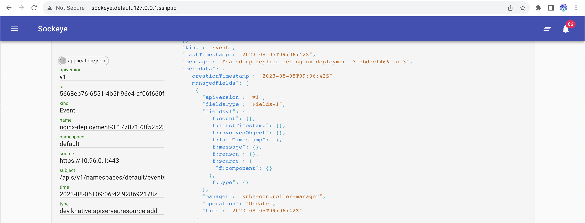

# Kubernetes向けDORAメトリクス + CloudEvents & CDEvents

---
_🌍 利用可能な言語_: [English](README.md) | [中文 (Chinese)](README-zh.md) | [日本語 (Japanese)](README-ja.md)

> **注意:** これは素晴らしいクラウドネイティブコミュニティの [🌟 コントリビューター](https://github.com/salaboy/platforms-on-k8s/graphs/contributors) によってもたらされました！

---

このチュートリアルでは、複数のソースから[CloudEvents](https://cloudevents.io)を消費し、Kubernetesネイティブなアーキテクチャ（クラウドに依存しない）を使用してDORAメトリクスを追跡できるコンポーネントのセットをインストールします。

このデモは、異なるイベントソースを観察し、これらのイベントをソフトウェアデリバリープラクティスに関連する意味のあるイベントにマッピングし、DORAメトリクスを計算するために集計できるようすることに焦点を当てています。

イベント変換フローは次のようになります：
- 入力は、異なるソースからの[CloudEvents](https://cloudevents.io)です
- これらのCloudEventsは、さらなる処理のために[CDEvents](https://cdevents.dev)にマッピングおよび変換できます
- DORA（またはその他の）メトリクスを計算するために集計関数を定義できます
- メトリクスは消費のために公開できます（この例ではRESTエンドポイントを介して）

## インストール

変換関数を実行するために、Knative Servingを使用したKubernetesクラスターを使用します。[第8章のKnative Servingをインストールしたクラスターを作成する手順](https://github.com/salaboy/platforms-on-k8s/tree/main/chapter-8/knative#creating-a-kubernetes-with-knative-serving)に従うことができます。

次に、Knative Eventingをインストールします。これはオプションでが、内部のKubernetesイベントを取得してCloudEventsに変換するKubernetes API Event Sourceをインストールするために使用します。

1. [Knative Eventing](https://knative.dev/docs/install/yaml-install/eventing/install-eventing-with-yaml/)をインストールします
```shell
kubectl apply -f https://github.com/knative/eventing/releases/download/knative-v1.11.0/eventing-crds.yaml
kubectl apply -f https://github.com/knative/eventing/releases/download/knative-v1.11.0/eventing-core.yaml
```

2. "dora-cloudevents"名前空間を作成します：
```shell
kubectl create ns dora-cloudevents
```

3. PostgreSQLをインストールしてテーブルを作成します
```shell
kubectl apply -f resources/dora-sql-init.yaml
helm install postgresql oci://registry-1.docker.io/bitnamicharts/postgresql --version 12.5.7 --namespace dora-cloudevents --set "image.debug=true" --set "primary.initdb.user=postgres" --set "primary.initdb.password=postgres" --set "primary.initdb.scriptsConfigMap=dora-init-sql" --set "global.postgresql.auth.postgresPassword=postgres" --set "primary.persistence.size=1Gi"
```

4. シンプルなCloudEventsモニターであるSockeyeをインストールします。これにはKnative Servingがインストールされている必要があります：

```shell
kubectl apply -f https://github.com/n3wscott/sockeye/releases/download/v0.7.0/release.yaml
```

5. [Kubernetes API Server CloudEvent Event Source](https://knative.dev/docs/eventing/sources/apiserversource/getting-started/#create-an-apiserversource-object)をインストールします：
```shell
kubectl apply -f api-serversource-deployments.yaml
```

## コンポーネント

このデモでは、CloudEventsをCDEventsに変換し、利用可能なデータを集計するために以下のコンポーネントをデプロイします。

- **CloudEvents Endpoint**: すべてのCloudEventsを送信するエンドポイント。これらのCloudEventsはSQLデータベースの`cloudevents-raw`テーブルに保存れます。

- **CloudEvents Router**: ルーティングテーブルを持つルーター。イベントを`CDEvents`に変換するためにルーティングします。このメカニズムにより、必要に応じて同じイベントタイプを複数の`CDEvents`に変換できます。このコンポーネントは`cloudevents-raw`テーブルから読み取り、イベントを処理します。このコンポーネントは設定可能な固定期間でトリガーされます。

- **CDEvents Transformers**: これらの関数は`CloudEvents Router`からイベントを受け取り、CloudEventsをCDEventsに変換します。結果は`CDEvents Endpoint`に送信されます。

- **CDEvents Endpoint**: `CDEvents`を送信するエンドポイント。これらのCloudEventsはSQLデータベースの`cdevents-raw`テーブルに保存されます。変換が不要なためです。このエンドポイントは、受信したCloudEventがCD CloudEventであることを検証します。

- **Metrics Functions**: これらの関数は異なるメトリクスを計算し、特別なテーブル（おそらくテーブルごとに1つ）に保存する責任があります。これらのメトリクスを計算するために、これらの関数は`cdevents-raw`から読み取ります。**デプロイメント頻度**メトリクスの計算方法の例を以下で説明します。

- **Metrics Endpoint**: 名前でメトリクスを照会し、フィルターを追加できるエンドポイント。これはオプションのコンポーネントです。これらのエンドポイントを使用せずに、メトリクステーブルからダッシュボードを構築することもできます。


## コンポーネントのデプロイとデータの生成

まず、以下のコマンドを実行してコンポーネントと変換関数をデプロイします：

```shell
kubectl apply -f resources/components.yaml
```

ブラウザで[http://sockeye.default.127.0.0.1.sslip.io/](http://sockeye.default.127.0.0.1.sslip.io/)にアクセスして、CloudEventsをモニタリングするためにSockeyeを開きます。

次に、設定が正しく動作していることをテストするために、`default`名前空間に新しいDeploymentを作成します。

```shell
kubectl apply -f test/example-deployment.yaml
```

この時点で、Sockeyeに大量のイベントが表示されるはずです：



デプロイメント頻度関数（変換と計算）がインストールされている場合、デプロイメント頻度エンドポイントにクエリを実行してメトリクスを確認できるはずです。Cronジョブを使用してデータを定期的に集計しているため、これには最大で数分かかる場合があることに注意してください：

```shell
curl http://dora-frequency-endpoint.dora-cloudevents.127.0.0.1.sslip.io/deploy-frequency/day | jq
```

作成したデプロイメントに応じて、次のような出力が表示されるはずです（私は`nginx-deployment`と`nginx-deployment-3`という2つのデプロイメントを作成しました）：

```shell
[
  {
    "DeployName": "nginx-deployment",
    "Deployments": 1,
    "Time": "2023-08-05T00:00:00Z"
  },
  {
    "DeployName": "nginx-deployment-3",
    "Deployments": 1,
    "Time": "2023-08-05T00:00:00Z"
  }
]
```

デプロイメントを変更したり新しいものを作成したりしてみてください。コンポーネントは`default`名前空間内のすべてのDeploymentをモニタリングするように設定されています。

すべてのコンポーネントは`dora-cloudevents`名前空間にインストールされていることに注意してください。以下のコマンドを実行して、ポッドとKnative ServicesのURLを確認できます：

`dora-cloudevents`名前空間のKnative ServicesのURLを確認します：
```shell
kubectl get ksvc -n dora-cloudevents
```

実行中のポッドを確認します。Knative Servingを使用しているため、使用されていないすべての変換関数が常に実行されている必要がないことが興味深いです：

```shell
kubectl get pods -n dora-cloudevents
```

最後に、データを集計するすべてのCronJob実行を確認するには、次のコマンドを実行します：

```shell
kubectl get cronjobs -n dora-cloudevents
```

## 開発

開発用に`ko`を使用して`dora-cloudevents`コンポーネントをデプロイします：

```shell
ko apply -f config/
```

# メトリクス

[https://github.com/GoogleCloudPlatform/fourkeys/blob/main/METRICS.md](https://github.com/GoogleCloudPlatform/fourkeys/blob/main/METRICS.md)より

## デプロイメント頻度


新しいまたは更新されたデプロイメントリソースを探します。これは、以前に設定した`APIServerSource`を使用して行われます。

フローは次のようになります：
```mermaid
graph TD
    A[API Server Source] --> |writes to `cloudevents_raw` table| B[CloudEvent Endpoint]
    B --> |read from `cloudevents_raw` table| C[CloudEvents Router]
    C --> D(CDEvent Transformation Function)
    D --> |writes to `cdevents_raw` table| E[CDEvents Endpoint]
    E --> F(Deployment Frequency Function)
    F --> |writes to `deployments` table| G[Deployments Table]
    G --> |read from `deployments` table| H[Metrics Endpoint]
```

バケットの計算：日次、週次、月次、年次。

これは1日あたりのデプロイメント数をカウントします：

```sql
SELECT
distinct deploy_name AS NAME,
DATE_TRUNC('day', time_created) AS day,
COUNT(distinct deploy_id) AS deployments
FROM
deployments
GROUP BY deploy_name, day;
```

## TODOと拡張

- `cloudevents_raw`および`cdevents_raw`テーブルに処理済みイベントメカニズムを追加します。これにより、`CloudEvents Router`と`Metrics Calculation Functions`が既に処理済みのイベントを再計算するのを避けることができます。これは、最後に処理されたイベントを追跡するテーブルを持ち、`CloudEvents Router`と`Metrics Calculation Functions`が新しいテーブルに対して結合することで実現できます。
- デプロイメント頻度メトリクスのバケットを計算するクエリを`deployment-frequency-endpoint.go`に追加します：週次、月次、年次。頻度ではなくボリュームを計算するためのブログ投稿を確認してください：https://codefresh.io/learn/software-deployment/dora-metrics-4-key-metrics-for-improving-devops-performance/
- 汎用コンポーネント（CloudEvents Endpoint、CDEvents Endpoint、CloudEvents Router）用のHelmチャートを作成します。
- PostgreSQL helmチャートのテーブル作成を自動化します（https://stackoverflow.com/questions/66333474/postgresql-helm-chart-with-initdbscripts）
- **変更のリードタイム**の関数を作成します。

## その他のソースと拡張

- [Tektonのインストール](https://github.com/cdfoundation/sig-events/tree/main/poc/tekton)
  - Tektonダッシュボード：`k port-forward svc/tekton-dashboard 9097:9097 -n tekton-pipelines`
  - Cloud Events Controller：`kubectl apply -f https://storage.cloud.google.com/tekton-releases-nightly/cloudevents/latest/release.yaml`
  - ConfigMap：`config-defaults` for <SINK URL>
- https://github.com/GoogleCloudPlatform/fourkeys
- https://cloud.google.com/blog/products/devops-sre/using-the-four-keys-to-measure-your-devops-performance
- Continuously Delivery Events aka [CDEvents](https://cdevents.dev)
- CloudEvents aka [CEs](https://cloudevents.io/)  
- GitHub Source：https://github.com/knative/docs/tree/main/code-samples/eventing/github-source
