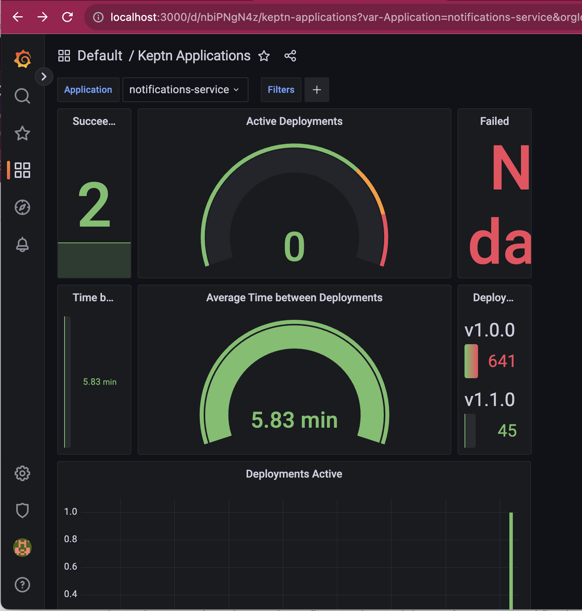

# Keptn Lifecycle Toolkit、すぐに使えるデプロイメント頻度

---
_🌍 利用可能な言語_: [English](README.md) | [中文 (Chinese)](README-zh.md) | [日本語 (Japanese)](README-ja.md)

> **注意:** これは素晴らしいクラウドネイティブコミュニティの [🌟 コントリビューター](https://github.com/salaboy/platforms-on-k8s/graphs/contributors) によってもたらされました！

---

この短いチュートリアルでは、Keptn Lifecycle Toolkitを使用して、クラウドネイティブアプリケーションのライフサイクルイベントをモニタリング、観察、対応する方法を探ります。

## インストール

[Keptn KLT](https://keptn.sh)をインストールするには、Kubernetesクラスターが必要です。[第2章](https://github.com/salaboy/platforms-on-k8s/blob/main/chapter-2/README-ja.md#kubernetes-kindを使用してローカルクラスタを作成する)で行ったように、Kubernetes KinDを使用してラスターを作成できます。

次に、Keptn Lifecycle Toolkit (KLT)をインストールできます。通常、これはKeptn Lifecycle Toolkit Helmチャートをインストールするだけで済みますが、このチュートリアルではダッシュボードを使用するためにPrometheus、Jaeger、Grafanaもインストールします。そのため、Keptn Lifecycle Toolkitリポジトリに基づいて、この例に必要なすべてのツールをインストールするためにMakefileを使用します。

以下を実行してください：

```shell
make install
```

**注意**: インストールプロセスには、必要なすべてのツールをインストールするために数分かかります。

最後に、KLTにモニタリングしたい名前空間を知らせる必要があります。そのために、名前空間に注釈を付ける必要があります：

```shell
kubectl annotate ns default keptn.sh/lifecycle-toolkit="enabled"
```

## Keptn Lifecycle toolkitの実践

Keptnは標準のKubernetes注釈を使用して、ワークロードを認識しモニタリングします。
Conference Applicationで使用されるKubernetes Deploymentには、以下のような注釈が付けられています。例えば、Agenda Serviceの場合：

```shell
        app.kubernetes.io/name: agenda-service
        app.kubernetes.io/part-of: agenda-service
        app.kubernetes.io/version: {{ .Values.services.tag  }}
```

これらの注釈により、ツールはワークロードについてより詳しく理解できます。例えば、この場合、ツールはサービス名が`agenda-service`であることを知ることができます。`app.kubernetes.io/part-of`を使用して、複数のサービスを同じアプリケーションの一部として集約できます。この例では、各サービスを個別にモニタリングできるように、各サービスを別個のエンティティとして保持しています。

この例では、KeptnTaskも使用します。これにより、デプロイメント前後にタスクを実行できます。以下の非常にシンプルな`KeptnTaskDefinition`の例をデプロイできます：

```yaml
apiVersion: lifecycle.keptn.sh/v1alpha3
kind: KeptnTaskDefinition
metadata:
  name: stdout-notification
spec:
  function:
    inline:
      code: |
        let context = Deno.env.get("CONTEXT");
        console.log("Keptn Task Executed with context: \n");
        console.log(context);
```

ご覧の通り、このタスクは実行コンテキストを出力するだけですが、ここで他のプロジェクトとの統合や外部システムの呼び出しを構築できます。Keptnの例を見ると、Slackに接続したり、負荷テストを実行したり、デプロイメントが更新後に期待通りに動作していることを検証したりするKeptnTaskDefinitionが見つかります。これらのタスクは、[Deno](https://deno.land/)（Typescriptをすぐに使用できる全なJavaScriptランタイム）、Python 3、または直接コンテナイメージを使用します。

以下を実行してデプロイします：

```shell
kubectl apply -f keptntask.yaml
```

KeptnTaskDefinitionを使用すると、プラットフォームチームはアプリケーションのデプロイメント前後のフックに組み込める再利用可能なタスクを作成できます。ワークロード（この場合はデプロイメント）に以下の注釈を追加することで、Keptnはデプロイメント実行後（および更新後）に自動的に`stdout-notification`を実行します：

```shell
  keptn.sh/post-deployment-tasks: stdout-notification
``` 

Conference applicationをデプロイし、JaegerとGrafanaのダッシュボードを開きましょう。別のタブで以下を実行してください：

```shell
make port-forward-jaeger
```

ブラウザで[http://localhost:16686/](http://localhost:16686/)にアクセスすると、以下のように示されるはずです：


そして、別のターミナルで以下を実行します：

```shell
make port-forward-grafana
```

ブラウザで[http://localhost:3000/](http://localhost:3000/)にアクセスします。`admin/admin`の認証情報を使用すると、以下のように表示されるはずです：


では、第2章で行ったようにConference Applicationをデプロイしましょう：

```shell
helm install conference oci://registry-1.docker.io/salaboy/conference-app --version v1.0.0
```

JaegerとGrafanaのKeptnダッシュボードを確認してください。デフォルトでは、Keptn Workloadsはデプロイメント頻度を追跡します。

Grafanaで、`Dashboards` -> `Keptn Applications`に移動します。異なるアプリケーションサービスを選択できるドロップダウンが表示されます。Notifications Serviceを確認してください。デプロイメントの最初のバージョンのみをデプロイしたため、あまり見るべきものはありませんが、サービスの新しいバージョンをリリースした後、ダッシュボードはより興味深いものになります。

例えば、notifications-serviceデプロイメントを編集し、`app.kubernetes.io/version`注釈の値を`v1.1.0`に更新し、コンテナイメージに使用されるタグを`v1.1.0`に更新します。

```shell
kubectl edit deploy conference-notifications-service-deployment
```

変更を行い、新しいバージョンが起動して実行されたら、再度ダッシュボードを確認してください。
Grafanaでは、2回目の成功したデプロイメントが表示され、私の環境ではデプロイメント間の平均時間が5.83分であり、`v1.0.0`は641秒かかったのに対し、`v1.1.0`はわずか40秒しかかからなかったことがわかります。ここには明らかに改善の余地があります。



Jaegerのトレースを見ると、Keptnのコアコンポーネントの1つである`lifecycle-operator`が、デプロイメントリソースをモニタリングし、デプロイメント前後のタスク呼び出しなどのライフサイクル操作を実行していることがわかります。


これらのタスクは、ワークロードが実行されているのと同じ名前空間でKubernetes Jobsとして実行されます。これらのタスクのログは、jobのポッドのログをtailすることで確認できます。

```shell
kubectl get jobs
NAME                                   COMPLETIONS   DURATION   AGE
post-stdout-notification-25899-78387   1/1           3s         66m
post-stdout-notification-28367-11337   1/1           4s         61m
post-stdout-notification-54572-93558   1/1           4s         66m
post-stdout-notification-75100-85603   1/1           3s         66m
post-stdout-notification-77674-78421   1/1           3s         66m
post-stdout-notification-93609-30317   1/1           3s         23m
```

ID `post-stdout-notification-93609-30317`のJobは、Notification Serviceデプロイメントの更新を行った後に実行されました。

```shell
> kubectl logs -f post-stdout-notification-93609-30317-vvwp4
Keptn Task Executed with context: 

{"workloadName":"notifications-service-notifications-service","appName":"notifications-service","appVersion":"","workloadVersion":"v1.1.0","taskType":"post","objectType":"Workload"}
```

## 次のステップ

Keptn Lifecycle Toolkitの機能と特徴についてさらに詳しく学ぶことを強くお勧めします。この短いチュートリアルで見たのは基本的な部分だけです。サービスのデプロイ方法をより細かく制御するために、[KeptnApplication](https://lifecycle.keptn.sh/docs/concepts/apps/)の概念を確認してください。Keptnを使用すると、どのサービスとのバージョンをデプロイできるかについて、詳細なルールを定義できます。

`app.kubernetes.io/part-of`注釈を使用して複数のサービスを同じKubernetesアプリケーションの一部としてグループ化することで、サービスのグループに対して事前および事後のアクションを実行でき、個々のサービスだけでなく、セット全体が期待通りに動作していることを検証できます。
